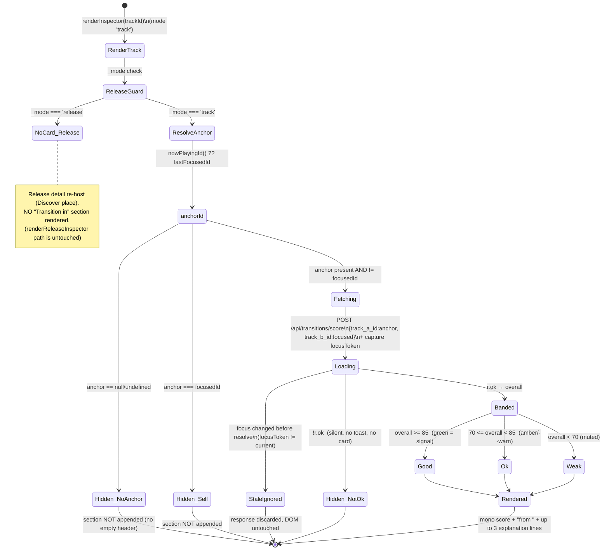

# Test design — fix/design-workbench (P2 coverage map)

Advisory coverage map for the two GATE-2 units in `crew/DESIGN.md` (APPROVED option **C**,
build **B → A**). I write NO test code — this is the behaviour/state inventory the
**test-verifier** implements as vitest units + e2e assertions. Traced to `crew/DESIGN.md`
and `crew/researcher.md`. Source cited `path:line`.

Drift-proof invariants for BOTH units: `pytest` count unchanged (no backend endpoint added),
no hardcoded hexes, mono for data, green=signal only, single ink-pill CTA, reduced-motion-gated.

---

## UNIT B — token-provenance + cleanup (no state; pure conformance/invariant checks)

All of B is static/in→out — **no state machine, no diagram.** One checklist row each.

### B1 — Vendor the `--zone-*` tokens into the design mirror

| # | Item (path:line) | Expected | Edge cases |
|---|---|---|---|
| B1-1 | `--zone-warmup` light (`app.css:3508` → `tokens/colors.css`) | byte-equal `rgba(0, 153, 187, .05)` present in vendored `:root` | whitespace/case must match the literal exactly (verifier asserts the substring, not a re-formatted value) |
| B1-2 | `--zone-build` light (`app.css:3509`) | byte-equal `rgba(192, 120, 0, .05)` in vendored `:root` | — |
| B1-3 | `--zone-peak` light (`app.css:3510`) | byte-equal `rgba(192, 32, 16, .05)` in vendored `:root` | — |
| B1-4 | `--zone-closing` light (`app.css:3511`) | byte-equal `rgba(153, 0, 204, .05)` in vendored `:root` | — |
| B1-5 | `--zone-warmup` dark (`app.css:3516` → `tokens/colors.css` `html.dark`) | byte-equal `rgba(0, 224, 255, .05)` | dark block, NOT light |
| B1-6 | `--zone-build` dark (`app.css:3517`) | byte-equal `rgba(255, 160, 0, .05)` | — |
| B1-7 | `--zone-peak` dark (`app.css:3518`) | byte-equal `rgba(224, 48, 30, .06)` | **note .06 not .05** — the one dark value that differs from the light alpha; a copy-paste that normalises to .05 must FAIL |
| B1-8 | `--zone-closing` dark (`app.css:3519`) | byte-equal `rgba(230, 0, 255, .05)` | — |
| B1-9 | Layout sizings NOT vendored (`app.css:3512-3513`) | `--nb-tile-height` / `--nb-joint-size` **absent** from `colors.css` | they are sizing, not colour (DESIGN B1 scope) — assert they did NOT leak into the colour mirror |
| B1-10 | app.css unchanged | the 4 live `:root`/`html.dark` `--zone-*` defs at `app.css:3507-3520` are untouched (app.css stays runtime source) | DESIGN: "Do NOT change the live app.css values" |
| B1-11 | Both-theme parity (cross-check) | for each of the 4 tokens, vendored light value == app.css light value AND vendored dark == app.css dark | a single-theme vendor (forgot `html.dark`) must FAIL |

### B2 — Fold the Duplicates-toolbar inline styles into a class

| # | Item (path:line) | Expected | Edge cases |
|---|---|---|---|
| B2-1 | `#wb-dupes-rescan` inline style (`index.html:479`) | no `font-size`/`padding` in the element's `style=` attr; styling moved to the shared class | element still parses; class applied |
| B2-2 | `#wb-dupes-bulk-delete` inline style (`index.html:482`) | no inline `font-size`/`padding` in `style=`; class applied | — |
| B2-3 | Shared class exists in `app.css` | `.wb-toolbar-sm` (or DESIGN-named) defines `font-size:12px; padding:4px 12px;` via scale tokens where exact | on-scale token vs literal both acceptable per DESIGN; assert computed font-size 12px / padding 4px 12px |
| B2-4 | `margin-left:auto` preserved on bulk-delete | bulk-delete remains right-aligned (utility class `.wb-toolbar-spacer` OR the one retained declaration) | the ONLY layout-affecting inline allowed to survive; e2e asserts it renders flush-right of the toolbar |
| B2-5 | id invariant — rescan | `#wb-dupes-rescan` id unchanged (control-inventory + e2e reference it) | id rename must FAIL |
| B2-6 | id invariant — bulk-delete | `#wb-dupes-bulk-delete` id unchanged | — |
| B2-7 | class invariant | `secondary-btn` on rescan, `primary` on bulk-delete preserved | the brand CTA class stays — green-is-signal / ink-pill rule |
| B2-8 | JS-toggled spans untouched | `#duplicates-status-label` / `#duplicates-summary` keep their `display:none` inline (`index.html:480-481`) | DESIGN B2: "Do NOT touch the two display:none spans" — a sweep that strips ALL inline styles must FAIL here |
| B2-9 | `disabled` attr preserved | bulk-delete still ships `disabled` (re-enabled by JS on non-keeper selection) | — |
| B2-10 | Visual parity (e2e) | toolbar renders identically to baseline: Rescan (left) + Delete non-keepers (right), same size | screenshot diff light + dark |
| B2-11 | No-build invariant | change is HTML/CSS only; no module graph change; `npm test` collection unchanged | — |

**B coverage notes:** B1 reads SOURCE — verifier uses `loadAppHtml()`/file read of `app.css` +
`tokens/colors.css` (not a rendered DOM; these are static-file assertions, vitest `readFileSync`
of the CSS is fine here since it's CSS not `index.html`). B2-1/2/5–9 read `index.html` via
`loadAppHtml()` per the `tests/web/_source.js` contract. B2-3/4/10 are computed-style / layout →
**e2e** (JSDOM can't compute layout — MEMORY: jsdom layout blind spot).

---

## UNIT A — Inspector "anchor-transition card" (STATEFUL → diagram + state-by-state checklist)

New `_section('Transition in')` block in `renderInspector()` (`inspector.js:69`, mode 'track' only).
Scores **anchor → focused track** via `POST /api/transitions/score`
(`schemas.py:265 TransitionRequest` / `:270 TransitionResponse`). Band cutoffs replicated locally
(`good ≥85 / ok ≥70 / else weak`) — same numbers as Nightboard `JOINT_BANDS`
(`canvas.js:20`) but NOT imported (avoid cross-feature coupling). Anchor read via new
`window.ACBridge.nowPlayingId()` (added at `08-set-builder-boot.js:1053` block; mirrors the
existing read-only pass-throughs).

### Flow & state — anchor resolution + scored render  (`inspector.js:renderInspector`)

### State → test mapping (each state ⇒ a vitest unit AND an e2e assertion)

| # | State (trigger) | Expected DOM/behaviour | Concrete copy | vitest unit | e2e assertion |
|---|---|---|---|---|---|
| A-1 | **no-anchor** — `nowPlayingId()` null AND no prior focus | NO `Transition in` section in `#wb-inspector-body`; no empty header | *(section absent — nothing rendered)* | mock `ACBridge.nowPlayingId → undefined`, `renderInspector(id)` → `querySelector('.wb-insp-section …Transition in')` is null | select a track with nothing playing & no prior focus → card absent |
| A-2 | **anchor == self** — `nowPlayingId() === focusedId` | section hidden (don't score track vs itself) | *(absent)* | `nowPlayingId → '7'`, render track `7` → no Transition section | play track, then focus the SAME track → no card |
| A-3 | **fallback to previously-focused** — no now-playing, prior `_focusedId` exists & ≠ current | anchor = last focused id; section renders scored | header "from \<prev title\>" | focus A, then focus B with `nowPlayingId→undefined` → fetch body `{track_a_id:A, track_b_id:B}` | focus A then B (nothing playing) → card shows "from \<A\>" |
| A-4 | **loading** — fetch in flight | transient state until resolve; no flicker of an empty card | `Scoring transition…` (single muted mono line) **OR** section deferred until resolve — verifier picks per build; copy if shown: **"Scoring transition…"** | assert the in-flight placeholder text (if build renders one) OR that no partial card paints pre-resolve | (covered by A-5/6/7 settle) |
| A-5 | **band good** — `overall ≥ 85` | mono score + good band class → green token (`--green`); "from \<anchor\>"; ≤3 explanation lines | e.g. score **`92`**, line "from **Midnight Drive**", reasons from API `explanation[]` | mock resp `{overall:92, explanation:[…]}` → score node text `92`, band class `good`, color resolves to `--green` family | play A, focus B (compatible) → green score chip + reasons visible |
| A-6 | **band ok** — `70 ≤ overall < 85` | mono score + ok band (amber `--warn`, NOT green) | score **`78`** amber | mock `{overall:78}` → band class `ok`, NOT green | screenshot amber band |
| A-7 | **band weak** — `overall < 70` | mono score + weak band (muted, NOT green/amber) | score **`54`**, muted | mock `{overall:54}` → band class `weak`, muted token | screenshot muted band |
| A-8 | **empty explanation** — `explanation: []` | score + band render; NO reason lines, NO empty bullets | score only, e.g. **`81`**, no reason rows | mock `{overall:81, explanation:[]}` → 0 reason nodes, section still present | edge: API returns no reasons → score-only card, no orphan list |
| A-9 | **>3 explanations** — `explanation.length > 3` | only first 3 rendered (DESIGN "up to 3") | 3 muted lines, 4th+ dropped | mock 5 reasons → exactly 3 reason nodes | — |
| A-10 | **release-mode** — `_mode === 'release'` | `renderReleaseInspector` path renders NO anchor card | *(absent — Discover detail only)* | `setInspectorMode('release')` + renderReleaseInspector → no Transition section | open a Discover release → inspector shows release detail, NO anchor card |
| A-11 | **stale-ignored** — focus changes mid-fetch | response for the OLD focus is discarded; current card untouched | *(no DOM mutation from the stale resolve)* | focus B (fetch pending) → focus C → resolve B's promise → assert C's card unchanged, B's score never painted (focus-token guard, like `_mode` guard at `inspector.js:296`) | rapid A→B→C selection → only C's transition shows |
| A-12 | **fetch !ok** — `r.ok === false` (e.g. 404/500) | silent: no card, NO toast (advisory only, DESIGN guard `if(!r.ok) return;`) | *(absent)* | mock `fetch → {ok:false}` → no Transition section, no toast spy call | server error path → card simply absent, app stable |
| A-13 | **anchor track not in `tracks()`** — id present but not resolvable to a title | card still scores; name label degrades gracefully | "from **track #\<id\>**" (or omit name, keep score) — verifier confirms chosen fallback copy | mock anchor id with no matching `tracks()` row → no crash, fallback label | edge guard |
| A-14 | **bpm=0 anchor / focused** — `bpm <= 0` | no NaN in derived fragments; BPM-guard honoured (CLAUDE.md `float(bpm) > 0`) | no `NaN BPM` text | render with `bpm:"0.0"` → no NaN substring | — |

### Data-state copy (the PLAN deliverable — write it now, not at BUILD; lesson #22)

Every data-driven state of the anchor card, with concrete strings:

- **Empty / no-anchor (A-1, A-2):** the section is **entirely absent** — NO header, NO placeholder.
  (DESIGN: "Hidden state must be clean: no empty section header when there's no anchor.")
- **Loading (A-4):** if the build shows an in-flight line: **"Scoring transition…"** (muted, mono),
  replaced on resolve. Acceptable alt per DESIGN: defer the whole section until resolve (no loading
  line). Verifier asserts whichever the build chose — but it must not paint a half-empty card.
- **Error / `!r.ok` (A-12):** **silent** — section absent, **no toast** (advisory card, not an action).
- **Good band (A-5):** score in `--green` (signal). Example row: `92 · from Midnight Drive` then
  reasons e.g. *"Keys 8A→9A are compatible"*, *"BPM 124→126 within range"* (strings come verbatim
  from API `explanation[]`; do NOT author client-side reason text — display only).
- **Ok band (A-6):** score in `--warn`/amber, NOT green. Example: `78 · from Slow Tide`.
- **Weak band (A-7):** score in `--muted`, NOT green/amber. Example: `54 · from Hard Floor`.
- **Edge — no reasons (A-8):** score + band only, e.g. `81 · from Echo Room`, no reason rows.
- **Not-live (XML/Pages mode):** the workbench inspector renders in **local mode only**; in
  XML/Pages mode there is no inspector + no `/api/transitions/score`, so the card never mounts.
  (Verifier need not e2e XML mode — it's frozen; note for completeness.)

### The 4 existing inspector consumers that MUST stay green (regression)

DESIGN A invariant: "The 4 existing inspector consumers stay green." Enumerated from `inspector.js`:

| # | Consumer (path:line) | Regression assertion |
|---|---|---|
| C-1 | **Track focus / `renderInspector`** (`inspector.js:69`, grid-click wiring `:331-348`) | focusing a row still renders header chips + Energy curve + Scores + Cues + Similar; new card is **additive**, doesn't displace these |
| C-2 | **Release mode / `renderReleaseInspector`** (`inspector.js:231`) | Discover release detail unchanged; `setInspectorMode('release')` still gates; NO anchor card (A-10) |
| C-3 | **`clearInspector`** (`inspector.js:304`) | clearing resets `_focusedId`, `_mode='track'`, restores `#disc-v2-detail-body` host, drawer slides out; any pending transition fetch must not repaint after clear (ties to A-11 stale guard) |
| C-4 | **Play button / `#wb-insp-play`** (`inspector.js:110-127`) | play affordance still wires `togglePlayTrack`/`ensureLocalAudio`; **note:** pressing Play sets `nowPlayingId` → a subsequent re-focus may flip the anchor — assert this doesn't throw and the card re-resolves cleanly |

### ACBridge accessor (the one legacy edit in Unit A)

| # | Item (path:line) | Expected | vitest |
|---|---|---|---|
| A-BR-1 | `nowPlayingId` pass-through (`08-set-builder-boot.js:1053` block) | `window.ACBridge.nowPlayingId()` returns the classic `nowPlayingId` (`01-core.js:522`); read-only | bridge exposes a function; returns null when nothing playing, the id when playing |
| A-BR-2 | read-only contract | bridge never mutates `nowPlayingId` | assert calling the accessor doesn't write |

---

## Not covered (and why)

- **Backend `POST /api/transitions/score` correctness** — pre-existing, reused unchanged (Nightboard
  precedent, `schemas.py:270`). Covered by existing `tests/test_*transition*`/Nightboard contract;
  Unit A adds NO backend code. `pytest` count must stay **unchanged** (drift proof) — that itself is
  the assertion. Out of scope to re-test the scorer.
- **Nightboard `JOINT_BANDS` / canvas band rendering** — A *replicates* the two cutoffs locally and
  must NOT import from `canvas.js`; we assert the local constants only, not Nightboard's.
- **Energy curve / mixability / classification / similar chip internals** — re-hosted legacy builders
  (`inspector.js:150,171,172,215`), already covered by their own suites; A only adds a sibling section.
- **XML/Pages mode** — frozen; inspector + transitions API are local-mode only (not-live state noted above).
- **`--zone-*` runtime rendering / Nightboard zones** — B1 only reconciles the *vendored mirror*; the
  live Nightboard zone rendering is unchanged and pre-covered by `tests/e2e/v2-nightboard.spec.ts`.
- **Visual pixel-diff of zone washes** — out of scope; B1 is a token-provenance text assertion, not a render.
- **`prefers-reduced-motion`** — any reveal animation must be gated, but DESIGN allows a static card
  (no animation required). If the build adds motion, the verifier adds a reduced-motion assertion;
  flagged here as conditional, not pre-specified.

---

## Verifier hand-off notes

- **Source reads:** `index.html` via `loadAppHtml()` (`tests/web/_source.js`); CSS files
  (`app.css`, `tokens/colors.css`) via direct file read (CSS, not the HTML contract).
- **JSDOM vs e2e split:** computed style / layout / right-alignment / screenshots → `tests/e2e/`
  (MEMORY: jsdom layout blind spot). Logic/DOM-presence/state-guards → vitest `tests/web/`.
- **Suggested new files:** `tests/web/v2-inspector-anchor.test.js`,
  `tests/web/design-zone-tokens.test.js` (or fold into an existing token test),
  `tests/web/v2-dupes-toolbar-class.test.js`; e2e in `tests/e2e/v2-inspector-anchor.spec.ts`
  + extend `tests/e2e/v2-duplicates-place.spec.ts` for B2-10. (Names advisory — verifier owns the impl.)
- **BOARD heartbeat:** not appended by me — `crew/BOARD.md` is append-only with concurrent writers
  (IMPLEMENTER currently WORKING); a Read→Write would clobber their lines. Coordinator logs my board row.

STATUS: DONE
