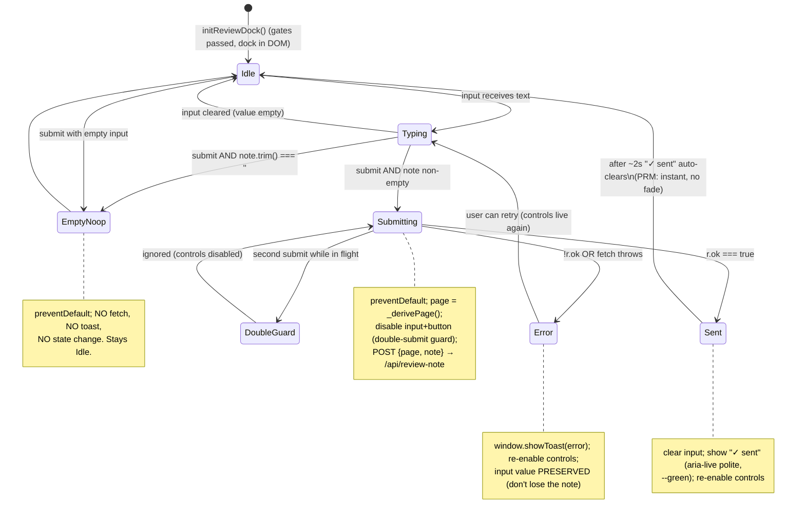

# Test design — REVIEW DOCK (dev-only feedback bridge) · P2 coverage map

Advisory coverage map for `crew/DESIGN.md` (REVIEW DOCK, approved 2026-06-19). I write NO test
code — this is the behaviour/state inventory the **test-verifier** implements as pytest +
vitest + e2e. Source cited `path:line`. Three parts: **API** `POST /api/review-note`,
**UI** `review-dock.js`, **STYLE** `.review-dock*`.

> ⚠️ **TOP-PRIORITY SAFETY INVARIANT — dev-only / prod-403.** The dock must NEVER be active for
> real users. **Two independent guards**, each tested in isolation AND together:
> 1. **Server:** `POST /api/review-note` returns **403** unless `AUTOCUE_REVIEW_DOCK == "1"`
>    (env read at request time; mirrors the `/api/perf/recent` 404 precedent `routes.py:4691-4697`,
>    but **403 per the spec, not 404**).
> 2. **Client:** `review-dock.js` renders **nothing to the DOM** unless `isLocalMode() === true`
>    **AND** `localStorage.ac_review_dock === '1'`.
> The Pages deploy has no FastAPI (guard 1 absent there) and localMode is false (guard 2 holds) →
> belt-and-braces. Any test that lets EITHER guard default-open is a release blocker. These are
> rows **S-1…S-6** below and must be the first green.

---

## SAFETY matrix (dev-only / prod-403) — highest priority

| # | Guard / condition | Expected | pytest | vitest | e2e |
|---|---|---|---|---|---|
| S-1 | env `AUTOCUE_REVIEW_DOCK` **unset** + POST | **403** (HTTPException), file NOT touched | `monkeypatch.delenv`, client.post → 403; assert `crew/REVIEW-NOTES.md` unchanged | — | live curl with env unset → 403 (DESIGN VERIFY) |
| S-2 | env `="0"` (or any non-`"1"`) + POST | **403** | parametrise `"0"`,`""`,`"true"`,`"yes"` → all 403 | — | — |
| S-3 | env `="1"` + POST | passes the gate (→ 200 path, see API rows) | `setenv("1")` → not 403 | — | — |
| S-4 | UI gate — localMode **false** (Pages/XML) | `initReviewDock()` appends NOTHING; `querySelector('.review-dock')` null | — | `ACBridge.isLocalMode → false`, flag `'1'` → no DOM node | — |
| S-5 | UI gate — flag **unset/≠'1'** (local mode) | no DOM node | — | localMode true, `localStorage` empty / `'0'` → null | live: flag unset → dock does NOT render (DESIGN VERIFY) |
| S-6 | UI gate — BOTH satisfied | dock renders | — | localMode true + flag `'1'` → `.review-dock` present | live: both set → dock pinned bottom |

---

## 1. API — `POST /api/review-note` (no UI state; in→out + side-effect rows)

Pure request→response + one file append. **No state machine** → checklist only.
Schema `ReviewNote { page: str = "", note: str }` (`schemas.py`); route on the `/api` router
(`routes.py`). Append target `Path.cwd()/"crew"/"REVIEW-NOTES.md"`.

| # | Item | Expected | Edge cases / copy | pytest |
|---|---|---|---|---|
| API-1 | gate (see S-1…S-3) | 403 unless env `=="1"` | env read per-request | covered by S-1/2/3 |
| API-2 | happy append | returns `{"ok": true}`; one line appended | line = `[YYYY-MM-DD HH:MM:SS] [<page>] <note>\n` | post `{page:"cues",note:"x"}` → 200, file ends with that line; freeze/parse the timestamp shape `^\[\d{4}-\d2-\d2 \d2:\d2:\d2\] \[cues\] x$` |
| API-3 | **empty note → 422** | reject `note==""` after strip | FastAPI/validator 422 | post `{note:""}` and `{note:"   "}` (whitespace-only) → 422; file untouched |
| API-4 | missing `note` field | 422 (required field) | — | post `{page:"x"}` → 422 |
| API-5 | default page | `page` omitted/`""` → stored as `"unknown"` | `[unknown]` in the line | post `{note:"hi"}` → line contains `[unknown]` |
| API-6 | page truncation | `page[:64]` | 100-char page → 64 chars in file | post 100-char page → stored page length 64 |
| API-7 | **one-line-per-note** (newline strip) | note's `\n`/`\r` stripped so each note is exactly ONE line | `note="a\nb\nc"` → file gains exactly 1 new line, no mid-line break | post multiline note → `REVIEW-NOTES.md` line count grows by exactly 1; the line has no embedded `\n` |
| API-8 | note strip | leading/trailing whitespace trimmed | `"  hi  "` → `hi` | assert stored `hi` |
| API-9 | parent/file autocreate | `crew/REVIEW-NOTES.md` (+ `crew/`) created if missing | uses tmp cwd | run in tmp_path cwd with no file → first post creates it |
| API-10 | append not overwrite | second post keeps the first line | 2 posts → 2 lines | post twice → 2 lines, order preserved |
| API-11 | page newline strip | newlines in `page` also stripped (one-line invariant) | `page="a\nb"` → single bracket token | post → no embedded newline in the line |
| API-12 | no auth/DB/Rekordbox surface | route never touches master.db or `_rb_running` | — | assert no DB import path hit (smoke: works with no Rekordbox) |
| API-13 | timestamp format | `datetime.now().strftime("%Y-%m-%d %H:%M:%S")` | local time, 24h | regex assert on the `[...]` timestamp |

**API edge copy (data-states of the stored line):**
- empty page → `[2026-06-19 14:22:01] [unknown] fix the dupes toolbar`
- normal → `[2026-06-19 14:22:01] [nightboard] joint colours look off in dark`
- multiline input `"a\nb"` collapses to one line → `… [cues] a b` (or `ab` — verifier confirms the
  join: DESIGN says "strip newlines"; assert NO embedded `\n`, exact join is the build's call).

---

## 2. UI — `docs/js/v2/review-dock.js` (STATEFUL submit flow → diagram + rows)

### `_derivePage()` mapping (pure, in→out → checklist)

| # | DOM condition (recompute on submit) | Returns | vitest |
|---|---|---|---|
| P-1 | `body.nb-active` | `"nightboard"` | set class → assert |
| P-2 | `body.wb-place-dupes` | `"duplicates"` | — |
| P-3 | `body.wb-place-discover` | `"discover"` | — |
| P-4 | `body.wb-place-library` | `"library"` | — |
| P-5 | none of the above | `window.ACBridge.crate()` value (e.g. `"all"`/`"cued"`) | mock `crate → 'cued'` → `"cued"` |
| P-6 | crate falsy / ACBridge absent | `"cues"` fallback | `crate → undefined` → `"cues"` |
| P-7 | precedence | `nb-active` wins even if a `wb-place-*` is also set | set both → `"nightboard"` |

`ACBridge` already exposes `isLocalMode` (`08-set-builder-boot.js:1056`), `crate` (`:1089`),
`nowPlayingId` (`:1067`) — no new bridge accessor needed for the dock.

### Submit flow — state machine  (`review-dock.js` submit handler)

### Submit state → test mapping

| # | State / branch | Expected DOM/behaviour | Concrete copy | vitest | e2e |
|---|---|---|---|---|---|
| U-1 | **idle (render)** | `.review-dock` form with sr-only label, page badge, input, ink-pill Send | placeholder **"describe a change for this page…"**; badge `[<page>]` mono | gates on → assert all sub-nodes exist | dock pinned bottom |
| U-2 | **typing** | input holds value; no network | — | set value → no fetch | — |
| U-3 | **empty → noop** | submit with `''`/whitespace → `preventDefault`, NO fetch, NO toast | *(nothing happens)* | spy fetch NOT called; spy showToast NOT called | press Enter empty → no request (route-mock 0 hits) |
| U-4 | **submitting** | controls disabled; POST `{page,note}` JSON to `/api/review-note` | — | mock fetch, submit → body `{page:_derivePage(), note}` ; input+button `disabled` during flight | — |
| U-5 | **double-submit guard** | a 2nd submit mid-flight is ignored (no 2nd fetch) | — | fire submit twice before resolve → fetch called once | rapid double-Enter → one request |
| U-6 | **sent (r.ok)** | input cleared; **"✓ sent"** shown, auto-clears ~2s; controls re-enabled | confirmation text **"✓ sent"** | mock `{ok:true}` → input `''`, `.review-dock-sent` text `✓ sent`; advance fake timers 2s → cleared | submit (route-mock ok) → "✓ sent" appears then clears |
| U-7 | **error (!r.ok)** | `window.showToast(error)`; input value PRESERVED; controls re-enabled | toast e.g. **"Couldn't send note"** | mock `{ok:false}` → showToast spy called; input value unchanged; not disabled | route-mock 500 → toast visible, note still in field |
| U-8 | **error (fetch throws/network)** | caught; toast; controls re-enabled (no dead UI) | same toast | mock fetch reject → no unhandled rejection, controls live | abort/offline → toast, recoverable |
| U-9 | **page recompute on submit** | `_derivePage()` called AT submit (not cached at render) | — | switch body class between render and submit → posted page reflects current | navigate to Nightboard then submit → body `page:"nightboard"` |
| U-10 | **r.ok check present** | reads `r.ok` before treating as success (CLAUDE.md fetch rule) | — | mock `{ok:false, json:{detail}}` → NOT treated as sent | — |

### A11y → test mapping

| # | A11y item | Expected | vitest | e2e |
|---|---|---|---|---|
| A11Y-1 | real label | `<label class="sr-only" for="review-dock-input">` text "Describe a change for this page" | assert label `htmlFor` ↔ input id | axe/role check |
| A11Y-2 | keyboard | Enter submits; input is a normal tab stop; Send reachable by Tab | dispatch Enter → submit fired | tab to input, type, Enter → sends |
| A11Y-3 | aria-live | confirmation node `aria-live="polite"` so "✓ sent" is announced | assert attr on the confirmation node | — |
| A11Y-4 | focus ring | visible focus ring on input (reuse `--green-ring`) | computed-style → e2e | focus input → ring visible (light+dark) |

### Motion (PRM) → test mapping

| # | Item | Expected | vitest | e2e |
|---|---|---|---|---|
| PRM-1 | reduced-motion | "✓ sent" fade + any slide is instant under `@media (prefers-reduced-motion: reduce)` | (CSS — e2e) | emulate reduce → no transition delay; confirmation appears/clears instantly |

---

## 3. STYLE — `.review-dock*` block (docs/css/app.css; tokens-only)

No state → checklist. Computed-style/layout/theme → **e2e** (jsdom layout blind spot, MEMORY).

| # | Item | Expected | Edge cases | test |
|---|---|---|---|---|
| ST-1 | **ink-pill Send, NEVER green** | Send button bg `--ink`, text `--on-ink`, `--radius-pill` | green = signal only (CLAUDE.md rule 2) | e2e computed bg == `--ink`, NOT `--green` |
| ST-2 | "✓ sent" uses `--green` | success signal in green | — | e2e color resolves to `--green` family |
| ST-3 | page badge mono | `.review-dock-page` uses `--font-mono` + `--muted` | data = mono (rule 3) | e2e font-family JetBrains Mono |
| ST-4 | input radius | `--radius-md` (8px) field, `--font-sans` | — | e2e |
| ST-5 | fixed bottom, full width | pinned bottom, z above action-bar/sticky (~140) | overlaps fixed `#action-bar` correctly | e2e bounding box at viewport bottom, above action bar |
| ST-6 | glass chrome | `--surface` bg + backdrop blur, top `1px solid var(--border)`, soft shadow | matches sticky-header idiom | e2e visual |
| ST-7 | **no hardcoded hexes** | only `var(--token)` in the `.review-dock*` block | — | source assert: grep block has no `#` hex |
| ST-8 | both themes | renders correct in light AND `html.dark` | toggle `html.dark` | e2e screenshot both |
| ST-9 | `.sr-only` utility | present (added if missing) — label visually hidden but in a11y tree | — | e2e label not visible, still labelled |
| ST-10 | inert on Pages | CSS ships but dock never renders there (guard 2) | — | covered by S-4 |

---

## Not covered (and why)

- **`/api/transitions/score` / inspector anchor card** — that was the PRIOR design (PR #245), already
  mapped + shipped; this file now covers the Review Dock only.
- **Real file write in e2e** — DESIGN says route-mock `/api/review-note` in e2e (don't write the real
  `crew/REVIEW-NOTES.md`). Actual file append is covered by **pytest in a tmp cwd** (API-9). The LIVE
  curl→file check is a manual GATE-2 step, not an automated spec.
- **AI tailing `REVIEW-NOTES.md`** — that's a human/agent workflow, not app code; no test.
- **index.html markup** — dock is JS-injected; assert (regression) that `index.html` gains NO
  `.review-dock` markup (dev-only invariant, DESIGN §VERIFY) — one source-read row the verifier can add.
- **Concurrent appends to REVIEW-NOTES.md** — single dev user, low volume; no locking specified, not tested.
- **showToast internals** — pre-existing global, only spied (U-7) not re-tested.

## Verifier hand-off notes

- **pytest:** new `TestReviewNote` class (suggest `tests/test_review_note.py`); use `tmp_path` +
  `monkeypatch.chdir` so `Path.cwd()/crew/REVIEW-NOTES.md` writes into the tmp dir, and
  `monkeypatch.setenv/delenv("AUTOCUE_REVIEW_DOCK")` for the gate. `pytest` count grows.
- **vitest:** new `tests/web/review-dock.test.js`; mock `window.ACBridge` (`isLocalMode`/`crate`),
  `localStorage`, `global.fetch`, `window.showToast`; fake timers for the 2s "✓ sent" clear.
- **e2e:** `tests/e2e/v2-review-dock.spec.ts`; set `localStorage.ac_review_dock='1'` before load,
  route-mock `/api/review-note`; run ALONE (#189 baseline). Computed-style/layout/theme → e2e only.
- **Safety first:** land S-1…S-6 before anything else — the prod-403 + no-render guards are the release gate.
- **BOARD heartbeat:** not appended by me — `crew/BOARD.md` is append-only with concurrent writers; a
  Read→Write would clobber their lines. Coordinator logs my board row (per standing-pane contract).

STATUS: DONE
