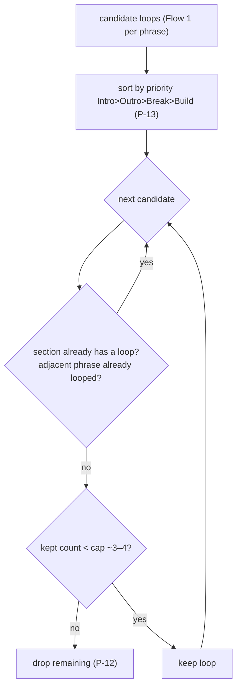
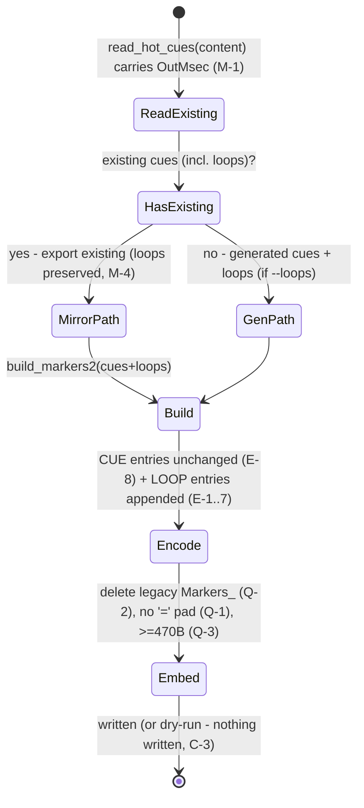
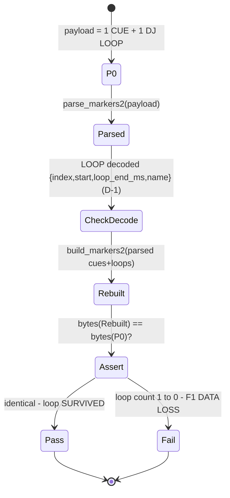
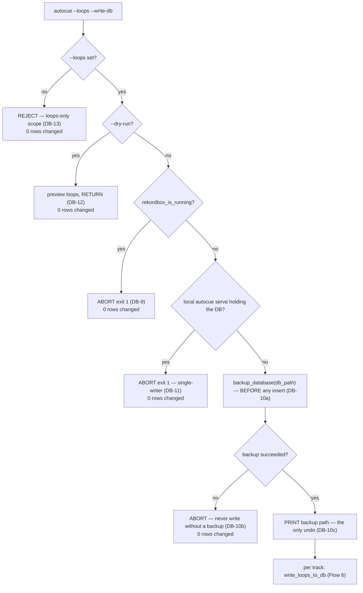
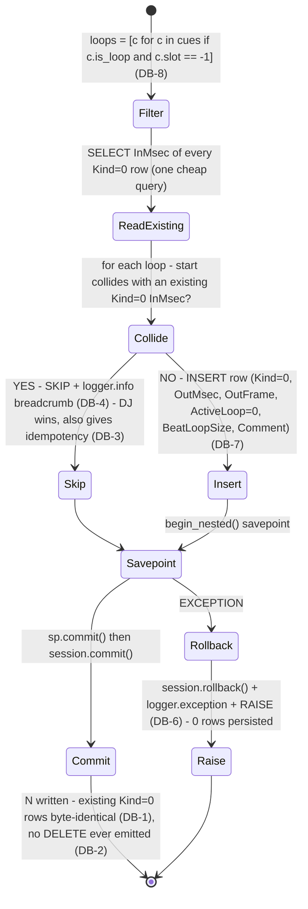

# Test design — AUTOLOOPS · INCREMENT 1 (Serato-first)

**Advisory coverage map only. No test code here.** Traces to `crew/DESIGN.md` (§1 keystone, §2
policy, §3 Serato encode/decode, §4 read-back, F1–F7) and `crew/researcher.md` §1 (LOOP byte layout).
Every row is written so a test can FAIL: it names the *guard it protects* and a concrete oracle.

Scope of INC-1: **CuePoint loop keystone + Serato LOOP encode/decode + mirror-first read-back +
policy**. RB XML (§5) and DB write are INC-2 → flagged **Not covered** below. The five sign-off
decisions (§0) are assumed: memory loops, grilled policy §2, Serato byte-lock **option (b)**, `--loops`.

> **⚠ BYTE-LOCK CAVEAT (F2/F7 — read before authoring the golden).** Researcher §1 rates the LOOP
> bytes `0x0a–0x12` (reserved/color) **LOW — PROBE**. The encode golden MUST be authored from a
> **real Serato-DJ-probed file** (or left `xfail`/skipped) — do NOT freeze speculative hex, or the
> golden gives false green. `start/end/name/locked/index/framing` are HIGH-confidence and lock now.

---

## Coverage checklist — POLICY (loop selection · pure in→out, no state) — `autocue/analyzer.py` (new loop pass) + `autocue/models.py`

Reuses phrase labels + `phrase_bars` + beat-grid `bar_ms` already computed (`analyzer.py:213-244`,
`models.py:62-71` `DJ_NAMES`). Each row = one falsifiable case; oracle is the returned loop CuePoint list.

| # | Item (path:line) | Expected | Guard it protects / edge cases |
|---|---|---|---|
| P-1 | Label→loop map, INTRO (`DESIGN §2` tbl; `models.py:6`) | INTRO phrase (bars≥4) → 1 loop, `name="Intro"`, `is_loop=True`, `loop_end_ms>position_ms` | G1 — loop only on mixable sections |
| P-2 | Label→loop map, OUTRO (`models.py:10`) | OUTRO phrase → loop `name="Outro"` | G1; bread-and-butter mix-out |
| P-3 | Label→loop map, DOWN/Break (`models.py:12`, `DJ_NAMES` `DOWN→"Break"`) | DOWN phrase → loop `name="Break"` | G1 |
| P-4 | Label→loop map, UP/Build **gated** (`models.py:11`, `DESIGN §2` "optional flag") | UP phrase → loop `name="Build"` **only when the Build opt-flag is on**; OFF ⇒ no Build loop | opt-flag gate; default excludes Build |
| P-5 | Label→loop map, NEVER (`DESIGN §2`; VERSE/CHORUS/BRIDGE `models.py:7,9,8`) | VERSE, CHORUS(Drop), BRIDGE, UNKNOWN phrases → **0 loops** | G1 — vocals/full-arrangement loop badly. FAIL if any loop emitted here |
| P-6 | Power-of-2 length, Intro/Outro (`DESIGN §2` "16→8→4") | `phrase_bars=16→16`; `=17→16`; `=12→8`; `=8→8`; `=7→4`; `=4→4` | G2 — largest power-of-2 **≤** phrase; rounds DOWN |
| P-7 | Power-of-2 length, Break/Build (`DESIGN §2` "8→4") | Break/Build cap at 8: `bars=16→8`; `=8→8`; `=5→4`; `=4→4` | G2 + section-specific ceiling (never 16-bar break) |
| P-8 | Clamp to phrase_bars (`DESIGN §2` "clamped to phrase_bars, never overruns") | loop length (bars) ≤ `phrase_bars`; end never past next phrase downbeat | G2 — no overrun into next phrase. Edge: `bars=6→4` (never 6) |
| P-9 | `phrase_bars < 4` skip (`DESIGN §2`) | phrase with `bars∈{0,1,2,3}` → **no loop** | too-short-to-loop guard. Edge: `bars=3→skip`, `bars=4→loop` (boundary) |
| P-10 | No beat grid ⇒ skip (`DESIGN §2`, F3; ANLZ try/except) | track with unparseable/absent beat grid (`bar_ms` unavailable) → **0 loops**, breadcrumb logged | F3 off-grid guard + SILENT-FAILURE lens (must log, not swallow) |
| P-11 | BPM guard (`DESIGN §2`, F5; `CLAUDE.md` `float(bpm)>0`) | `bpm` in `{0, "0.0", negative}` → **0 loops** (no /0, no garbage length) | F5 — reuse `float(bpm)>0`. Edge: `"0.0"` (truthy string, zero float) |
| P-12 | Cap ~3–4 loops/track (`DESIGN §2` "Cap ~3–4") | track with ≥5 eligible phrases → at most the cap (assert exact N once implementer picks 3 or 4) | prevents loop spam. **Needs cap constant pinned — flag to human** |
| P-13 | One-per-section, priority order (`DESIGN §2` Intro→Outro→Break→Build) | when > cap qualify, kept set follows Intro>Outro>Break>Build; no two adjacent phrases both loop | G3 — no stacking. Edge: 2 Intros + 2 Outros + 1 Break, cap 3 → {Intro,Outro,Break} |
| P-14 | Naming from `DJ_NAMES` (`models.py:62-71`) | name is the DJ label, not enum/numeric (`"Break"` not `"Down"`/`"Loop 1"`) | naming source correctness |
| P-15 | Disambiguation (`analyzer.py:227-239` pattern) | two Break phrases → `"Break 1"`, `"Break 2"`; single Break → `"Break"` (no suffix) | mirrors cue disambiguation. Edge: 1 occurrence = bare name |
| P-16 | Start = phrase downbeat (`DESIGN §2`; existing cue position) | loop `position_ms` == the phrase-cue downbeat ms (beat-grid aligned) | seamless-loop guard (start on grid) |
| P-17 | Clamp end before track end (`DESIGN §2` "must not run into silence") | last Outro loop `loop_end_ms` ≤ track duration ms | no loop into trailing silence |
| P-18 | `loop_beats` = bars×4 (`DESIGN §1`, `models.py` new field) | `loop_beats == selected_bars * 4` | keystone field integrity |

## Coverage checklist — KEYSTONE (`CuePoint` loop fields · `autocue/models.py:88-109`)

| # | Item (path:line) | Expected | Guard it protects / edge cases |
|---|---|---|---|
| K-1 | `loop_end_ms` default (`models.py:88-101` new field) | `CuePoint(...)` w/o loop args ⇒ `loop_end_ms is None`, `loop_beats is None` | **regression** — every existing construction unchanged |
| K-2 | `is_loop` property (`DESIGN §1` `is_loop ⇔ loop_end_ms is not None`) | `is_loop == (loop_end_ms is not None)`; `False` for all legacy cues | branch key for encode/XML. Edge: `loop_end_ms=0` ⇒ `is_loop=True` (0 is a valid ms) |

---

## Coverage checklist — ENCODE (Serato LOOP bytes · `serato_writer.py:79-98` `build_markers2`)

Branch CUE-vs-LOOP on `cue.is_loop`. LOOP framing/layout per `researcher.md §1` (opt-b).
Fixed portion = **20 bytes**, name at **0x14**. Positions **ms, uint32 BE** (same as CUE path).

| # | Item (path:line) | Expected | Guard it protects / edge cases |
|---|---|---|---|
| E-1 | LOOP framing (`researcher §1`; `serato_writer.py:96` CUE analogue) | entry = `b"LOOP\x00"` + `uint32be(len(data))` + data | framing correctness. FAIL if `"CUE\x00"` emitted for a loop |
| E-2 | LOOP data layout (`researcher §1` table) | `0x00`=`\x00`, `0x01`=index, `0x02:06`=start uint32BE ms, `0x06:0a`=end uint32BE ms, `0x0a:0e`=`\xff\xff\xff\xff`, `0x0e:13`=color block+byte (**PROBE**), `0x13`=locked, `0x14+`=name UTF-8+NUL | byte-lock (HIGH fields). `0x0a–0x12` = PROBE — see caveat |
| E-3 | start/end units (`researcher §1` "ms uint32 BE") | start==`loop.position_ms`, end==`loop.loop_end_ms`, both big-endian 4-byte | unit/endianness parity with CUE |
| E-4 | End sentinel on encode (`researcher §1` `0xFFFFFFFF=undefined`) | generated loops always have an end ⇒ end **never** `0xFFFFFFFF`; a `loop_end_ms=None` cue is a CUE not a LOOP | keeps generated loops well-defined |
| E-5 | locked byte (opt-b `DESIGN §0.3`) | `0x13 == 0x00` (unlocked) for generated loops | option-(b) default |
| E-6 | name at fixed offset (`researcher §1` "0x14") | UTF-8 name + NUL begins at byte 0x14; empty name ⇒ single `\x00` at 0x14 (len==21) | offset-fixed name. Edge: multibyte UTF-8 name length |
| E-7 | LOOP index (`researcher §1` "loop number, 0-based") | index is the loop's own slot counter (0,1,2…), **independent of A–H cue slots** | loop-slot separate from cue slot (`DESIGN §0.1`) |
| E-8 | CUE entries unchanged when loops present (`DESIGN §3`) | mixed list [cues + loops] ⇒ CUE bytes **byte-identical** to a cues-only payload; loops appended, cues untouched | no cross-contamination of the CUE path |
| E-9 | memory-cue skip still holds (`serato_writer.py:83-84`) | `slot<0` / `slot>7` cues still skipped; loop-flag doesn't resurrect a memory cue | existing skip invariant |

---

## Coverage checklist — DECODE / PRESERVE (`serato_writer.py:124-156` `parse_markers2`) — **F1, highest severity**

Today `parse_markers2` only decodes `etype=="CUE"` (`serato_writer.py:147`) → LOOP dropped → a rewrite
**wipes the DJ's saved loops**. INC-1 must decode + preserve.

| # | Item (path:line) | Expected | Guard it protects / edge cases |
|---|---|---|---|
| D-1 | Decode LOOP entry (`serato_writer.py:147` new branch) | `parse_markers2` returns a dict `{type:"LOOP", index, position_ms, loop_end_ms, name}` for a LOOP | LOOP no longer silently dropped |
| D-2 | Decode end sentinel (`researcher §1` `0xFFFFFFFF`) | LOOP whose end==`0xFFFFFFFF` ⇒ `loop_end_ms is None` (**not** `4294967295`) | undefined-end must not become a 49-day loop |
| D-3 | Decode name @0x14 (`researcher §1`) | name read from byte 0x14, NUL-terminated UTF-8 | offset parity with encode |
| D-4 | **F1 survive-rewrite round-trip** (`DESIGN §3` "Assert byte-for-byte round-trip") | build a payload w/ 1 CUE + 1 LOOP → `parse_markers2` → rebuild via `build_markers2` → **bytes identical**; the LOOP still present | **F1 data-loss** — the single most important assertion. FAIL if loop count drops 1→0 |
| D-5 | Mirror-preserve DJ loop (`DESIGN §3` mirror-first) | a track with an existing Serato LOOP the writer didn't generate → after a fresh AutoCue write the DJ's LOOP is still readable (name+pos+end) | never clobber a DJ's saved loop |
| D-6 | Unknown/short entries tolerated (`serato_writer.py:141-155` framing) | malformed/short LOOP (`length<20`) ⇒ passed through as `{type:"LOOP"}` w/o crash, not decoded as bogus positions | parser robustness (no IndexError) |

---

## Coverage checklist — MIRROR-FIRST READ-BACK (`db_writer.py:147-179` `read_hot_cues`) — **F6**

Today `read_hot_cues` reads `InMsec` only, drops `OutMsec` (`db_writer.py:172`) → existing RB loops
read back as **point cues**. Carry `OutMsec` (+`BeatLoopSize`) so a real loop mirrors as a loop.

| # | Item (path:line) | Expected | Guard it protects / edge cases |
|---|---|---|---|
| M-1 | Loop row → loop CuePoint (`db_writer.py:170-178`) | a `DjmdCue` row with `OutMsec>0` → CuePoint with `loop_end_ms==OutMsec`, `is_loop=True` | F6 — RB loop mirrors as loop, not degraded point |
| M-2 | Point cue → non-loop (`db_writer.py:172`) | a row with `OutMsec` NULL/0/absent → `loop_end_ms is None`, `is_loop=False` | **regression** — real point cues unchanged. Edge: `OutMsec=0` and `OutMsec=None` both ⇒ None |
| M-3 | `has_existing_hot_cues` unchanged (`DESIGN §4`; `db_writer.py:140-144`) | overwrite/skip counting of existing cues incl. loops (Kind) semantics **unchanged** by the read-back edit | skip/overwrite gate not perturbed |
| M-4 | Mirror source picks existing loop (`cli.py:194-197`) | a track whose RB cues include a loop → export_pairs carries the loop CuePoint (existing wins over generated) | mirror-first precedence for loops |

---

## Coverage checklist — QUIRKS (payload/file level · confirm they still hold with LOOP entries)

| # | Item (path:line) | Expected | Guard it protects / edge cases |
|---|---|---|---|
| Q-1 | No `=` base64 padding (`serato_writer.py:108`, `:120`) | outer/envelope base64 of a LOOP-containing payload has **no `=`** (`replace("=","A")` / `rstrip("=")`) | Serato parser rejects `=`; operates on whole payload incl. LOOP |
| Q-2 | Legacy `Markers_` deletion (`serato_writer.py:15,267,280,291`) | on every write (loops present or not) the legacy `Serato Markers_` tag is deleted per container | a stale legacy loop must not shadow our Markers2 loop |
| Q-3 | `_MIN_TAG_LEN` pad still applied (`serato_writer.py:111-113`) | LOOP-containing outer still NUL-padded to ≥470 bytes | envelope invariant |

## Coverage checklist — REGRESSION (INC-1 must not change the shipped CUE path)

| # | Item (path:line) | Expected | Guard it protects / edge cases |
|---|---|---|---|
| R-1 | CUE golden byte-identity (`tests/test_serato_writer.py:31-33` `GOLDEN_PAYLOAD`) | `build_markers2([cue])` (no loops) == existing `GOLDEN_PAYLOAD` `0101435545…496e74726f0000` **exactly** | **regression** — non-loop output byte-identical to today |
| R-2 | Non-loop CuePoint behaves as today (`DESIGN §1` "loop_end_ms=None → behave exactly as today") | full pipeline for a track with no eligible loop phrases ⇒ identical XML/Serato output to pre-branch | keystone regression-safety |
| R-3 | 8-cue payload unchanged (`tests/test_serato_writer.py:44-53` `_eight_cues`) | existing multi-cue golden/round-trip tests still pass unmodified | no collateral change |

## Coverage checklist — CLI (`autocue/cli.py`)

| # | Item (path:line) | Expected | Guard it protects / edge cases |
|---|---|---|---|
| C-1 | `--loops` flag exists (`cli.py:56-92` new `add_argument`) | `--loops` is a registered `store_true`; parses without error | opt-in surface exists |
| C-2 | `--loops` gates generation (`DESIGN §0.4`) | **without** `--loops` ⇒ **0** loop CuePoints anywhere (Serato + XML); **with** `--loops` ⇒ loops emitted per policy | opt-in gate. FAIL if loops appear without the flag |
| C-3 | `--loops --serato --dry-run` (`cli.py:175-177`) | prints loop placements, writes **no** files ("Dry run — no files written.") | dry-run safety incl. loops |
| C-4 | `--loops --serato` real write path (`cli.py:179-205`) | Serato write includes LOOP entries in the embedded tag; summary line prints | end-to-end wiring |
| C-5 | `--loops` no-op w/o a write target (`DESIGN §0.4`) | `--loops` with neither `--serato` nor a resulting write ⇒ no crash; loops only materialize where a writer consumes them | **ambiguous — see Not-covered NC-4; flag to human** |

---

## Data-driven / edge STATES — concrete expected copy (lesson #22 — states are a PLAN deliverable)

Written as concrete oracles so the verifier pins exact behavior, not prose.

| State | Trigger | Concrete expected (copy / outcome) |
|---|---|---|
| **No eligible phrase** | `--loops`, track has only VERSE/CHORUS/BRIDGE phrases (P-5) | Track exports with cues only, **0 LOOP entries**. CLI cue-mirror line unchanged (`"… mirroring N cue(s) from Rekordbox"`) |
| **No beat grid** (edge/error) | `--loops`, ANLZ beat grid unparseable (P-10) | **0 loops** for that track; a breadcrumb is logged (SILENT-FAILURE lens) — a genuine parse failure is distinguishable from "no eligible phrase". FAIL if it silently returns `[]` with no log |
| **BPM = 0 / "0.0"** (edge) | `--loops`, `bpm` non-positive (P-11) | **0 loops**; no ZeroDivisionError, no garbage-length loop |
| **Phrase too short** (edge) | `--loops`, all eligible phrases `bars<4` (P-9) | **0 loops** emitted; track still gets its cues |
| **Not-live: `--loops` absent** | any write without the flag (C-2) | Byte-identical to today (`GOLDEN_PAYLOAD`); no loop concept present anywhere |
| **Dry-run** (not-write) | `--loops --serato --dry-run` (C-3) | stdout lists placements; final line `"Dry run — no files written."`; filesystem untouched |
| **Existing DJ loop present** (preserve) | rewrite over a file/track that already has a saved loop (D-5/M-1) | The DJ's loop **survives** — same name, start, end after write (F1) |
| **Cap exceeded** (edge) | `--loops`, ≥5 eligible phrases (P-12/P-13) | Exactly `cap` loops kept, priority Intro>Outro>Break>Build, one-per-section |
| **Undefined-end loop decoded** (edge) | parse a LOOP with end `0xFFFFFFFF` (D-2) | `loop_end_ms is None` — not `4294967295` |
| **Empty-name loop** (edge) | encode a loop with `name==""` (E-6) | data length == 21 (20 fixed + single NUL); name byte at 0x14 == `\x00` |

---

## Flows & state (Mermaid — one per stateful/multi-step behavior)

### Flow 1 — per-phrase loop decision (POLICY, `DESIGN §2`)
```mermaid
flowchart TD
    A["phrase (label, phrase_bars, bpm, bar_ms)"] --> B{--loops set?}
    B -->|no| Z0["no loop (C-2)"]
    B -->|yes| C{beat grid parseable?<br/>bar_ms available}
    C -->|no| Z1["no loop + LOG breadcrumb (P-10/F3)"]
    C -->|yes| D{float(bpm) > 0?}
    D -->|no| Z2["no loop (P-11/F5)"]
    D -->|yes| E{label in INTRO/OUTRO/DOWN,<br/>or UP w/ Build-flag?}
    E -->|no VERSE/CHORUS/BRIDGE/UNKNOWN| Z3["no loop (P-5/G1)"]
    E -->|yes| F{phrase_bars >= 4?}
    F -->|no| Z4["no loop (P-9)"]
    F -->|yes| G["len = largest power-of-2 <= phrase_bars<br/>ceiling 16 (Intro/Outro) or 8 (Break/Build) — P-6/P-7"]
    G --> H["start = phrase downbeat (P-16)<br/>end = start + len*bar_ms, clamp <= next phrase & <= track end (P-8/P-17)"]
    H --> I["emit loop CuePoint<br/>name=DJ_NAMES[label] (+disambig), loop_beats=len*4 (P-14/15/18)"]
```

### Flow 2 — track-level cap & one-per-section priority (`DESIGN §2` "Cap ~3–4, one per section")

```mermaid
flowchart TD
    A["candidate loops (Flow 1 per phrase)"] --> B["sort by priority Intro>Outro>Break>Build (P-13)"]
    B --> C{next candidate}
    C --> D{section already has a loop?<br/>adjacent phrase already looped?}
    D -->|yes| C
    D -->|no| E{kept count < cap ~3–4?}
    E -->|no| F["drop remaining (P-12)"]
    E -->|yes| G["keep loop"] --> C
```

### Flow 3 — Serato write path incl. mirror-first (`cli.py:179-205`, `DESIGN §3/§4`)

```mermaid
stateDiagram-v2
    [*] --> ReadExisting: read_hot_cues(content) carries OutMsec (M-1)
    ReadExisting --> HasExisting: existing cues (incl. loops)?
    HasExisting --> MirrorPath: yes - export existing (loops preserved, M-4)
    HasExisting --> GenPath: no - generated cues + loops (if --loops)
    MirrorPath --> Build: build_markers2(cues+loops)
    GenPath --> Build
    Build --> Encode: CUE entries unchanged (E-8) + LOOP entries appended (E-1..7)
    Encode --> Embed: delete legacy Markers_ (Q-2), no '=' pad (Q-1), >=470B (Q-3)
    Embed --> [*]: written (or dry-run - nothing written, C-3)
```

### Flow 4 — F1 loop-preservation round-trip (highest-severity, `DESIGN §3`, D-4/D-5)

```mermaid
stateDiagram-v2
    [*] --> P0: payload = 1 CUE + 1 DJ LOOP
    P0 --> Parsed: parse_markers2(payload)
    Parsed --> CheckDecode: LOOP decoded {index,start,loop_end_ms,name} (D-1)
    CheckDecode --> Rebuilt: build_markers2(parsed cues+loops)
    Rebuilt --> Assert: bytes(Rebuilt) == bytes(P0)?
    Assert --> Pass: identical - loop SURVIVED
    Assert --> Fail: loop count 1 to 0 - F1 DATA LOSS
    Pass --> [*]
    Fail --> [*]
```

---

## #99 PARTITION — implementer TDD unit vs verifier DISJOINT golden/behavioral

Two authors, **disjoint files**, no assertion overlap. Implementer proves *unit contracts* (TDD, red→green
as they build); verifier proves *observable end-to-end behavior* (independent, incl. the F1 survival golden
and the real-artifact CLI drive). Independence is the point — a suite the builder wrote is not independent proof.

| Case IDs | Home file | Owner | Why here |
|---|---|---|---|
| P-1..P-18, K-1/K-2 | `tests/test_autoloops_policy.py` **(new)** | **implementer** (TDD) | Pure in→out policy/keystone units — fast, drive the code as written |
| E-1..E-7, D-1..D-3, D-6, M-1..M-3 | `tests/test_serato_writer.py` (extend) + `tests/test_db_writer.py` (extend) | **implementer** (TDD) | Single-entry encode/decode + read-back units live beside the existing CUE unit tests |
| **D-4, D-5** (F1 survive-rewrite), **E-8** (CUE-untouched golden), **R-1..R-3** (regression byte-identity), **C-2..C-5** (CLI behavioral), the STATES table, no-grid breadcrumb (P-10) | `tests/test_autoloops_golden.py` **(new, verifier-owned)** | **verifier** (DISJOINT) | Golden bytes for a fixture track + F1 data-loss survival + CLI stdout — behavioral, author-independent from the builder's units |
| Q-1..Q-3 | either (payload-level) — recommend verifier golden | **verifier** | Whole-payload invariants best checked on the real embedded tag |
| **GATE-2 real-artifact** (§ acceptance): `autocue --track … --loops --serato --dry-run` + real write to a throwaway copy + read-back; **user opens in Serato DJ Pro** | `crew/test-verifier.md` runbook (not a unit) | **verifier + user** | F7 — green tests ≠ Serato accepts it; the byte-lock (F2) is only *proven* by the user's Serato screenshot |

**Rule:** verifier's `test_autoloops_golden.py` must NOT re-assert the implementer's single-entry layout
(that's E-1..E-7 in the unit file); it asserts the *composed* payload golden + survival + regression identity.

---

## Not covered (and why)

- **NC-1 · RB XML loop mark (`writer.py:46-51`, `DESIGN §5`)** — **now covered in INCREMENT 2 below.**
- **NC-2 · Direct `master.db` loop write (`write_cues_to_db`, `DESIGN §6`)** — **now covered in INCREMENT 3 below.**
- **NC-3 · The exact `0x0a–0x12` reserved/color bytes (`researcher §1` LOW/PROBE)** — NOT lockable from
  source; the encode golden for these bytes must come from a real Serato-probed file, else be `xfail`/skip.
  Locked only after F2 probe + F7 user Serato-verify. **Do not freeze speculative hex.**
- **NC-4 · `--loops` interaction with mirror-first on a track that has existing hot cues but NO loop** —
  `cli.py:194-200` short-circuits `existing or generated`, so generated loops are dropped when any existing
  cue is present. **Open design question:** should `--loops` still layer generated loops onto a mirrored cue
  set? DESIGN §2 says "layered on existing phrase cue output" but §4 mirror wins. **Flag to human.**
- **NC-5 · Active-loop arming (`ActiveLoop=1`, `DESIGN §6`)** — we write *saved* loops, not an armed loop.
- **NC-6 · Energy-ranked break selection (`DESIGN §2` "Future")** — deferred; policy picks by label+priority only.
- **NC-7 · Web-UI / serve-API loop surface** — no loop concept in the UI; explicit non-goal.
- **NC-8 · Cap constant (3 vs 4) and Build-opt-flag name** — not fixed in DESIGN; P-12 asserts "≤ cap" until
  the implementer pins the constant. **Flag to human/implementer to lock the number + flag spelling.**

---

## Human review ask
Please review/extend before the verifier implements — specifically confirm: **(a)** the cap constant
(3 or 4) and the Build opt-flag spelling (P-12/NC-8); **(b)** the NC-4 mirror-first×`--loops` interaction;
**(c)** that the encode golden stays `xfail`/skip until the F2 Serato probe lands (NC-3). Then hand this
map to the test-verifier for the DISJOINT golden file.

<!-- P2-AUTOLOOPS-INC1 -->
STATUS: DONE

---
---

# Test design — AUTOLOOPS · INCREMENT 2 (Rekordbox XML loop marks)

**Advisory only. No test code here.** Traces to `crew/DESIGN.md` §5 + `crew/researcher.md` §2.
INC-2 = teach `write_xml` (`autocue/writer.py:44-51`) to emit `<POSITION_MARK Type="loop" …>` when
`cue.is_loop`, else the current `Type="cue"`. Grounded facts:
`RekordboxXml.add_mark(Name, Type="cue", Start, End=None, Num=-1)` accepts `Type="loop"` (POSMARK
enum `"4"→"loop"`) and carries `Name + Start + End` (researcher §2). Today `writer.py:46-51`
hardcodes `Type="cue"` with **no `End`**. Depends on the INC-1 keystone (`is_loop`, `loop_end_ms`)
already merged. Existing test harness: `tests/test_writer.py` (`_parse_position_marks` → each
`POSITION_MARK.attrib`; note Start is a raw float string per its header, `test_writer.py:5-6`).

> **UNITS ARE THE TRAP.** `Start` is emitted in **seconds** via `cue.position_sec`
> (`models.py:103-105`, `writer.py:49`). `End` MUST also be seconds — `loop_end_ms / 1000.0` — not
> raw ms. An ms-where-seconds bug makes a 13 s loop end at 13000 s. This is the highest-value INC-2 assertion.

## Coverage checklist — RB XML loop marks (`autocue/writer.py:44-51`)

| # | Item (path:line) | Expected | Guard it protects / edge cases |
|---|---|---|---|
| X-1 | `is_loop` cue → loop mark (`writer.py:44-51`; researcher §2 POSMARK `"4"→"loop"`) | a `CuePoint` with `is_loop=True` emits `<POSITION_MARK Type="loop" Start=… Name=… End=…>` (Type is **"loop"**, and an `End` attribute is present) | branch correctness. FAIL if a loop still emits `Type="cue"` or omits `End` |
| X-2 | **UNITS — Start AND End in SECONDS** (`writer.py:49` `position_sec`; `models.py:103-105`) | `float(mark["Start"]) == loop.position_ms/1000` **and** `float(mark["End"]) == loop.loop_end_ms/1000`; e.g. start 5000 ms → `"5"`, end 13000 ms → `"13"` (raw float string, `test_writer.py:5-6`) | **no ms-where-seconds bug** — End uses `loop_end_ms/1000.0`, same conversion as Start. FAIL if End == "13000" |
| X-3 | Name carried (`writer.py:47`; researcher §2 "Name unchanged") | loop mark `Name` == the loop's DJ name (`"Outro"`, `"Break 1"`), never blank / enum value / `Num` | naming parity with cues. Edge: `name=""` falls back to `label.value` like cues (`writer.py:47` `cue.name or cue.label.value`) |
| X-4 | **REGRESSION — non-loop cue unchanged** (`writer.py:44-51`) | a `CuePoint` with `loop_end_ms=None` emits `Type="cue"` with **NO `End` attribute** and identical `Name`/`Start`/`Num` to today | attr-identical to pre-INC-2. FAIL if a plain cue gains an `End` attr or flips Type |
| X-5 | Mirror-first loop exports as loop mark (`cli.py:194-197` + `db_writer` OutMsec, INC-1) | a CuePoint sourced from `read_hot_cues` with `loop_end_ms` set (existing RB loop) → XML loop mark, **not** a point mark | F6 end-to-end: existing RB loop round-trips to XML as a loop |
| X-6 | Clamped-end loop still valid (`DESIGN §2` end-clamp; `writer.py`) | a loop whose `loop_end_ms` was clamped ≤ track end emits `End` with `Start < End ≤ track duration (sec)` | clamp survives into XML; no negative/zero-length mark |
| X-7 | Mixed cues + loops in ONE track (`writer.py:44-51` loop) | a track with N cues + M loops → N `Type="cue"` marks (no `End`) + M `Type="loop"` marks (with `End`), all in the same TRACK element, order preserved | per-cue branch is independent; no cross-contamination |
| X-8 | Edge — `End < Start` guard (`writer.py`; `DESIGN §2`) | if `loop_end_ms <= position_ms` (malformed/degenerate loop) the writer does not emit an inverted loop — either skip or clamp (assert chosen behavior once implementer decides) | no `End ≤ Start` mark reaches Rekordbox. **Behavior to pin — flag to implementer** |
| X-9 | Edge — `End == None` on an `is_loop` cannot happen (`DESIGN §1` `is_loop ⇔ loop_end_ms is not None`) | `is_loop=True` guarantees `loop_end_ms is not None`, so the loop branch never passes `End=None`; a `loop_end_ms=None` cue takes the cue branch (X-4) | invariant guard — the two branches are mutually exclusive on `is_loop` |

## Data-driven / edge STATES — RB XML (concrete oracles)

| State | Trigger | Concrete expected |
|---|---|---|
| **All-cue track (not-live for loops)** | `--loops` off, or no eligible phrase | Every `POSITION_MARK` is `Type="cue"` with no `End` — byte/attr-identical to today (X-4) |
| **Loop present** | `is_loop` cue in the list | `Type="loop"`, `Start` and `End` both seconds, `Name` = DJ label (X-1/X-2/X-3) |
| **Mixed** | cues + loops one track | interleaved cue (no End) + loop (End) marks, all under one TRACK (X-7) |
| **Degenerate loop** (edge) | `loop_end_ms ≤ position_ms` | no inverted mark emitted (skip/clamp — pin behavior, X-8) |

## #99 PARTITION — INC-2 (implementer TDD unit vs verifier golden)

| Case IDs | Home file | Owner | Why here |
|---|---|---|---|
| X-1, X-2, X-3, X-4, X-8, X-9 | `tests/test_writer.py` (extend) | **implementer** (TDD) | Single-mark attribute units live beside the existing `_parse_position_marks` cue tests; drive the branch as written |
| **X-2 (units, golden), X-5 (mirror-first end-to-end), X-7 (mixed-track golden)**, the STATES table | `tests/test_autoloops_golden.py` (verifier-owned, extend the INC-1 golden file) | **verifier** (DISJOINT) | Full-track XML golden (exact `Type`/`Start`/`End`/`Name` set) + the mirror path — author-independent from the builder's units |

**Rule:** the verifier golden asserts the *composed* TRACK element (all marks, exact attrs); the
implementer unit asserts *single-mark* branch behavior. No overlap.

## GATE-2 — USER step (real artifact, by profile = CLI → Rekordbox)
Automated proof stops at the XML attribute set. **True proof requires the user:** run
`autocue --library --loops --output autocue_import.xml` (no `--serato`), then in Rekordbox
**File > Import Library → select the XML** and confirm (a) named memory loops appear at the right
positions with the right names, and (b) they **sync to a CDJ** (researcher §2 parity claim). **SHOW
the evidence** — the user's Rekordbox screenshot of the imported named loops. Green attr-tests ≠
"Rekordbox accepts it" (the INC-2 analogue of F7).

## Not covered — INC-2
- **Per-cue color on loops** — XML format has no per-cue color (`writer.py:5-7`); track-level only. Out of scope.
- **Direct `master.db` loop write** — see INCREMENT 3 below.
- **X-8 degenerate-loop policy** (skip vs clamp) — behavior not fixed in DESIGN; **flag to implementer** to decide, then the test pins it.

<!-- P2-AUTOLOOPS-INC2 -->
STATUS: DONE

---
---

# Test design — AUTOLOOPS · INCREMENT 3 (DB-DIRECT loop write, `--write-db`)

> # 🚨 THIS INCREMENT MUTATES THE USER'S REAL REKORDBOX LIBRARY.
> **The coverage map IS the safety case.** Every other increment writes a file the user can throw
> away; this one writes `master.db` — the DJ's hand-built library, with no import/review step. A bug
> here **destroys hand-placed memory cues** and the only undo is the backup we take.
> **A test that cannot fail here is a liability, not coverage.**

Advisory only. No test code here. Traces to `crew/DESIGN.md` "INCREMENT 3" + `crew/researcher.md`
P0-DBWRITE (clobber analysis, columns/units, test precedent `tests/test_duplicates_integration.py:47-60`).

## The trap being designed AROUND (cite it in the test file header)
`write_cues_to_db` is **UNSAFE for loops on BOTH branches — DO NOT REUSE IT** (researcher headline):
- `overwrite=True` → **`DELETE ... WHERE ContentID=? AND Kind==0`** (`db_writer.py:519-524`) — wipes
  **every** memory cue AND memory loop the DJ hand-placed. **This is the clobber.**
- `overwrite=False` + any existing `Kind=0` row → `write_memory=False` (`db_writer.py:504`) → the loop
  is **silently not written** (silent no-op).
- Memory cues and memory loops share the `Kind=0` space; the discriminator is `OutMsec`
  (`-1` = point cue per `db_writer.py:538`, `> InMsec` = loop).
⇒ **The new `write_loops_to_db()` must NEVER issue a DELETE.** No-clobber by *construction*, and
DB-2 proves it structurally (not just by outcome).

## Coverage checklist — SAFETY (highest severity · `write_loops_to_db`, new in `db_writer.py`)

| # | Item (path:line) | Expected | Guard it protects / edge cases |
|---|---|---|---|
| **DB-1** | **NO-CLOBBER** (`DESIGN §5` "the load-bearing test"; the clobber = `db_writer.py:519-524`) | Seed DjmdContent + **2 pre-existing `Kind=0` memory cues** (`OutMsec=-1`) + 1 hot cue → `write_loops_to_db(...)` → **both original memory-cue rows STILL EXIST, byte-identical** (assert EVERY column: `ID`, `UUID`, `InMsec`, `InFrame`, `OutMsec`, `Kind`, `Comment`, `ColorTableIndex`, `ContentUUID`) | **THE WHOLE SAFETY CASE.** Destroying a DJ's hand-placed memory cues. FAIL if any row is missing *or* any column mutated |
| **DB-2** | **NO DELETE EVER ISSUED** (structural; `DESIGN §1` "no DELETE anywhere ⇒ clobber impossible by construction") | Attach a SQLAlchemy `before_cursor_execute` event listener to the scratch engine, run `write_loops_to_db(...)`, assert **no emitted statement contains `DELETE`** against `djmdCue` (capture + assert on the SQL text) | Stronger than DB-1: catches a DELETE that happens to match 0 rows *in the fixture* but would clobber in the wild. FAIL if any DELETE is emitted |
| **DB-3** | **IDEMPOTENT** (`DESIGN §1` step 2; `researcher :403`) | Call `write_loops_to_db(...)` **twice** → 2nd call inserts **ZERO** rows, returns `0`; total `Kind=0` row count identical after run 1 and run 2 | Re-running the CLI must not duplicate loops. FAIL if row count grows on re-run |
| **DB-4** | **COLLISION → skip + breadcrumb** (`DESIGN §1` step 2/5; exact `InMsec` match, `DESIGN §1` "Collision tolerance") | A generated loop whose `position_ms` **exactly equals** an existing `Kind=0` row's `InMsec` → that loop is **NOT inserted** (DJ wins, mirror-first); a `logger.info` breadcrumb names the skip (`caplog`); **other, non-colliding loops in the same call ARE still written** | Mirror-first (DJ's cue wins) **+ silent-failure lens** (a skip must be observable). FAIL if it's inserted, or skipped with no log, or if one collision suppresses the whole track |
| **DB-5** | **MIRROR-NEGATIVE — pins WHY we don't reuse `write_cues_to_db`** (`db_writer.py:519-524`, `:504`) | (a) `write_cues_to_db(content, [mem cue], db, overwrite=True)` with pre-existing `Kind=0` rows → those rows **ARE DELETED** (assert gone). (b) `overwrite=False` with an existing `Kind=0` row → the memory cue is **silently NOT written** (`write_memory=False`) | Pins the hazard in a test. If this test ever fails, someone changed `write_cues_to_db`'s semantics and the INC-3 rationale must be re-derived. **Must be able to fail** — it is a characterization test of the dangerous function |
| **DB-6** | **EXCEPTION → rollback, no partial write, RAISED** (`DESIGN §1` step 4; mirrors `db_writer.py:555-558`) | Force a failure mid-write (e.g. `generate_unused_id` raises on the 2nd loop) → `pytest.raises(...)` (**error propagates, not swallowed**); **ZERO** new rows persisted (incl. the 1st loop — all-or-nothing per call); pre-existing `Kind=0` rows still intact; `logger.exception` breadcrumb emitted | Partial writes + swallowed errors. FAIL if the 1st loop survives, or if the exception is caught and turned into a `return 0` |

## Coverage checklist — COLUMNS / UNITS (`DESIGN §2` · confirmed vs the read side)

| # | Item (path:line) | Expected | Guard it protects / edge cases |
|---|---|---|---|
| **DB-7** | Loop-row column set (`DESIGN §2`; parity with `db_writer.py:525-550`) | For each inserted loop row assert **all** of: `Kind == 0` (memory) · `InMsec == loop.position_ms` · `InFrame == round(position_ms*150/1000)` (parity `db_writer.py:527`) · **`OutMsec == loop.loop_end_ms` (MILLISECONDS)** · **`OutFrame == round(loop_end_ms*150/1000)`** (150 sub-frames/s) · `OutMpegFrame == OutMpegAbs == 0` · **`ActiveLoop == 0`** · **`BeatLoopSize == loop.loop_beats` (BEATS = bars×4)** · `Comment == loop.name` · `ContentID == content.ID` · `UUID` non-empty & unique · `ID` from `db.generate_unused_id` | Unit bugs are invisible until a CDJ misbehaves. **Named traps:** `OutMsec` in **seconds** (not ms) → 13 s loop ends at 13 ms; `BeatLoopSize` in **bars** (not beats) → an 8-bar loop reports 8 beats (should be 32); **`ActiveLoop=1`** → the loop **auto-arms on load** and the track starts looping on the DJ (non-goal `DESIGN §6`); `OutMsec=-1` → the row silently degrades to a **point cue** (`db_writer.py:538` sentinel) |
| **DB-8** | Only memory LOOPS are written (`DESIGN §1` step 1: `c.is_loop and c.slot == -1`) | Pass a **mixed** list: [hot cue `slot=0`, memory **point** cue `slot=-1, loop_end_ms=None`, memory **loop** `slot=-1, is_loop`] → **exactly 1 row inserted** (the memory loop); **no `Kind≥1` row added**; **no `Kind=0` point-cue row added** | Scope containment — writing *cues* to the DB is explicitly **NOT** this increment (`DESIGN §4`). FAIL if a hot cue or point cue leaks into the DB |

## Coverage checklist — GUARDS (CLI `--write-db`, `autocue/cli.py`; contract copied from `routes.py:975-997`)

| # | Item (path:line) | Expected | Guard it protects / edge cases |
|---|---|---|---|
| **DB-9** | Refuse when **Rekordbox is running** (`DESIGN §3.1`; `rekordbox_is_running` `db_writer.py:107-126`; mirrors `routes.py:980-981`) | `rekordbox_is_running(db_path)` → True ⇒ CLI prints an error to **stderr**, `sys.exit(1)`, **ZERO** DB writes, **no backup taken** | SQLCipher lock / DB corruption. Rekordbox open = the DB is locked & cached. FAIL if any insert is attempted |
| **DB-10** | **Backup BEFORE any insert, and backup FAILURE ABORTS** (`DESIGN §3.2-3.4`; `backup_database` `db_writer.py:15-48`; mirrors `routes.py:995-997`) | (a) **ORDERING:** `backup_database` is called **before** the first `session.add` (assert call order via spy/`mock_calls`); (b) `backup_database` raising ⇒ write **ABORTED**, **ZERO** rows written, non-zero exit, error surfaced; (c) the backup **path is PRINTED** to stdout (`~/.autocue/backups/master_<TS>.db`) | **Never write without a successful backup** — the backup is the user's ONLY undo (no XML review step on this path). FAIL if a row lands before/without a backup, or if a backup error is swallowed and the write proceeds |
| **DB-11** | Refuse when a local **`autocue serve`** holds the DB (`DESIGN §3.5` NEW #RISK; single-writer rule `db-constraints.md:56-72`) | A running local serve (port/lock probe positive) ⇒ CLI **refuses**, exits non-zero, **ZERO** writes — even though `rekordbox_is_running` returns False | **Single-writer rule.** `rekordbox_is_running` does **not** detect `autocue serve`, which holds a read-write handle → concurrent CLI+server writes corrupt. FAIL if the write proceeds with a serve up |
| **DB-12** | `--write-db --dry-run` writes **NOTHING** (`DESIGN §4`; dry-run block returns first, `cli.py:201-217`) | `--loops --write-db --dry-run` ⇒ loop preview printed; **0 rows inserted**, **0 rows deleted**, DB byte-identical (and no backup needed since nothing is written) | Dry-run safety on a **mutating** path. FAIL if any row changes |
| **DB-13** | `--write-db` **without** `--loops` is rejected / no-op (`DESIGN §4` "gates on `--loops`") | `--write-db` alone ⇒ **ZERO** DB writes (rejected with a clear message + non-zero exit, **or** documented no-op — pin whichever the implementer chooses) | **Loops-only scope.** Writing *cues* to the DB is a much larger scope, explicitly NOT this increment — this flag must not become a backdoor to it. **Behavior to pin — flag to implementer** |

## Data-driven / edge STATES — `--write-db` (concrete expected copy)

| State | Trigger | Concrete expected (copy / outcome) |
|---|---|---|
| **Rekordbox running** (refuse) | DB-9 | stderr: `"Error: Rekordbox is running. Close Rekordbox before writing to the database."` · exit 1 · **0 rows changed** · no backup |
| **`autocue serve` running** (refuse) | DB-11 | stderr: error naming the single-writer conflict (a local AutoCue server holds the DB) · exit 1 · **0 rows changed** |
| **Backup OK** (happy path) | DB-10c | stdout: `"Backup → ~/.autocue/backups/master_<TS>.db"` — **printed, because it is the user's only undo** · then `"Wrote N loop(s) to <title>"` |
| **Backup FAILS** (error) | DB-10b | stderr: `"Backup failed — aborting. No changes written."` · non-zero exit · **0 rows changed** |
| **Dry-run** (not-write) | DB-12 | loop preview lines · `"Dry run — no files written."` · **DB byte-identical** |
| **Re-run / all loops collide** (idempotent) | DB-3 / DB-4 | `"0 loop(s) written (N skipped — existing cue at that position)"` · **0 new rows** |
| **Partial collision** | DB-4 | colliding loop skipped + `logger.info` breadcrumb; non-colliding loops **still written** |
| **No eligible loops** (empty) | no phrase qualifies | `"0 loop(s) written"` · no error · **0 rows changed** |
| **Exception mid-write** (error) | DB-6 | rollback · `logger.exception` `"Write failed for <title> — rolled back"` · exception **RAISED** · **0 rows persisted** |
| **`--write-db` w/o `--loops`** (rejected) | DB-13 | clear rejection message · non-zero exit · **0 rows changed** |

## Flows & state (Mermaid)

### Flow 5 — `--write-db` guard chain (every abort path leaves the DB untouched)

```mermaid
flowchart TD
    A["autocue --loops --write-db"] --> B{--loops set?}
    B -->|no| Z1["REJECT — loops-only scope (DB-13)<br/>0 rows changed"]
    B -->|yes| C{--dry-run?}
    C -->|yes| Z2["preview loops, RETURN (DB-12)<br/>0 rows changed"]
    C -->|no| D{rekordbox_is_running?}
    D -->|yes| Z3["ABORT exit 1 (DB-9)<br/>0 rows changed"]
    D -->|no| E{local autocue serve holding the DB?}
    E -->|yes| Z4["ABORT exit 1 — single-writer (DB-11)<br/>0 rows changed"]
    E -->|no| F["backup_database(db_path) — BEFORE any insert (DB-10a)"]
    F --> G{backup succeeded?}
    G -->|no| Z5["ABORT — never write without a backup (DB-10b)<br/>0 rows changed"]
    G -->|yes| H["PRINT backup path — the only undo (DB-10c)"]
    H --> I["per track: write_loops_to_db (Flow 6)"]
```

### Flow 6 — `write_loops_to_db` per-track transaction (append-only, no DELETE)

```mermaid
stateDiagram-v2
    [*] --> Filter: loops = [c for c in cues if c.is_loop and c.slot == -1] (DB-8)
    Filter --> ReadExisting: SELECT InMsec of every Kind=0 row (one cheap query)
    ReadExisting --> Collide: for each loop - start collides with an existing Kind=0 InMsec?
    Collide --> Skip: YES - SKIP + logger.info breadcrumb (DB-4) - DJ wins, also gives idempotency (DB-3)
    Collide --> Insert: NO - INSERT row (Kind=0, OutMsec, OutFrame, ActiveLoop=0, BeatLoopSize, Comment) (DB-7)
    Skip --> Savepoint
    Insert --> Savepoint: begin_nested() savepoint
    Savepoint --> Commit: sp.commit() then session.commit()
    Savepoint --> Rollback: EXCEPTION
    Rollback --> Raise: session.rollback() + logger.exception + RAISE (DB-6) - 0 rows persisted
    Commit --> [*]: N written - existing Kind=0 rows byte-identical (DB-1), no DELETE ever emitted (DB-2)
    Raise --> [*]
```

## 🔒 TEST-HARNESS RULE — scratch DB only, NEVER the live library

**Non-negotiable for every automated test in this increment:**
1. **In-memory SQLite + the real pyrekordbox schema** — the `tests/test_duplicates_integration.py:44-70`
   fixture verbatim: `create_engine("sqlite:///:memory:")` → `t.Base.metadata.create_all(engine)` →
   `sessionmaker` → a `MagicMock` db shim exposing `.session` (+ `.get_content`).
2. **⚠️ MUST stub `db.generate_unused_id(DjmdCue)`** (`db_writer.py:530`) — an unstubbed `MagicMock`
   **silently writes `ID=<MagicMock>`** and the test can still pass while producing garbage rows
   (researcher P0-DBWRITE `:477-478`). A fixture without this stub is a false-green trap.
3. **NO test may touch the real `master.db`.** No `MasterDatabase()` with no args; no path under
   `~/Library/Pioneer/rekordbox/`. Grep the new test file for `MasterDatabase(` — it must not appear.
4. **Schema-pin the loop columns** — introspect `DjmdCue.__table__.columns` so a future pyrekordbox
   schema change (renamed/dropped `OutMsec`/`BeatLoopSize`/`ActiveLoop`) **fails the test** rather
   than silently writing nothing (the trick `test_duplicates_integration.py` uses for the cascade).
5. **`tests/test_autoloops.py` discipline holds** — it never opens a real DB (monkeypatches ANLZ via
   `_fake_anlz`); keep it that way.

## GATE-2 — REAL-DB-**COPY** verification (verifier + user; NOT a unit test)
Automated proof stops at a scratch SQLite. The real schema/driver is SQLCipher, and the real risk is
the DJ's actual library. **Verify on a COPY, never the live DB:**
1. `cp ~/Library/Pioneer/rekordbox/master.db /tmp/ac-scratch/master.db` (+ `-wal`/`-shm`).
2. **Snapshot BEFORE:** dump every `Kind=0` row for the target track (`ID`, `InMsec`, `OutMsec`, `Comment`).
3. Run `autocue --track "<title>" --loops --write-db --db-path /tmp/ac-scratch/master.db`.
4. **Snapshot AFTER** and **diff**: assert (a) **every pre-existing `Kind=0` row is byte-identical**
   ← the no-clobber proof on real data; (b) the new loop rows carry the §2 columns/units;
   (c) re-run → **zero** new rows (idempotent on real data).
5. **SHOW the evidence** — the before/after row diff in the report.
6. **Optional user step:** open the *copy* in Rekordbox → named memory loops appear, DJ's memory cues intact.
**Never** run step 3 against the live library. The backup path printed by the CLI is the user's undo, but
a verification run must not need it.

## #99 PARTITION — INC-3 (this is the strongest independence case in the feature)

| Case IDs | Home file | Owner | Why here |
|---|---|---|---|
| DB-3 (idempotency), DB-4 (collision skip + breadcrumb), DB-7 (columns/units), DB-8 (loops-only filter) | `tests/test_autoloops_dbwrite.py` **(new)** | **implementer** (TDD, write these while building) | Unit contracts of `write_loops_to_db` on the scratch DB — drive the function as written |
| **DB-1 (NO-CLOBBER byte-identical survival)** · **DB-2 (no DELETE at the query level)** · **DB-5 (mirror-negative: `write_cues_to_db` DOES delete)** · **DB-6 (rollback / raise / no partial)** · **DB-9..DB-13 (CLI guard chain)** | `tests/test_autoloops_db_safety.py` **(new, verifier-owned)** | **verifier** (DISJOINT, independent author) | **The safety case must be authored by someone who did NOT write the writer.** An implementer who forgot the no-DELETE rule would equally forget to test for it — the clobber test would be written to match the code, not the requirement. This is the whole point of #99 |
| Real-DB-**COPY** before/after diff (above) | `crew/test-verifier.md` runbook | **verifier** (+ user) | Scratch SQLite ≠ SQLCipher master.db; the no-clobber claim needs one run on real data (on a COPY) |

**Rule:** the verifier's safety file must NOT re-assert the implementer's column units (DB-7); it
asserts **survival, absence of DELETE, abort paths, and the characterization of the dangerous
function**. Zero assertion overlap.

## Not covered — INC-3 (and why)
- **Writing non-loop CUES to the DB** — explicitly out of scope (`DESIGN §4`); DB-13 is the gate that
  keeps it out. A future increment, with its own safety case.
- **`ActiveLoop=1` (armed loops)** — non-goal (`DESIGN §6`); DB-7 asserts `ActiveLoop == 0`.
- **Server / `/api/*` loop write** — non-goal; `write_cues_to_db` is deliberately **left untouched** so
  the shared server path (`/api/apply`, `/api/generate-apply`, SSE, `memory_cue_mode`) cannot regress.
  *Coverage implication:* the existing `write_cues_to_db` suite must still pass **unmodified** —
  treat any diff to that function as out-of-scope and reject it at review.
- **`/api/restore` / backup-restore round-trip** — the backup is *taken* and its path printed (DB-10);
  restoring it is the existing restore surface, unchanged by this increment.
- **Collision tolerance window** — DESIGN locks **exact `InMsec` match** (conservative, matches
  `cli._merge_loops`). If that ever loosens to ±ms, **DB-4 must change with it**. Flagged.
- **Multi-track failure semantics** — `write_loops_to_db` commits **per call/track**, so a failure on
  track 7 leaves tracks 1–6 committed. **Not covered / behavior to pin:** is that acceptable, or should
  `--write-db --library` be one transaction? **Flag to human** — with a printed backup it's recoverable,
  but the CLI should say which tracks landed. (DB-6 covers the *per-track* all-or-nothing guarantee only.)
- **SQLCipher-specific behavior** — the scratch fixture is plain SQLite; encryption/locking differences
  are only exercised by the real-DB-COPY step above.

## Human review ask — INC-3
Confirm before the verifier implements: **(a)** DB-13 behavior (hard-reject vs silent no-op for
`--write-db` without `--loops`); **(b)** the multi-track failure semantics (per-track commit vs one
transaction for `--library`); **(c)** that the single-writer serve-probe (DB-11) is in scope for this
increment — it is a NEW guard with no precedent in `cli.py`, and it is the one guard the server contract
does *not* already give us.

<!-- P2-AUTOLOOPS-INC3 -->
STATUS: DONE
