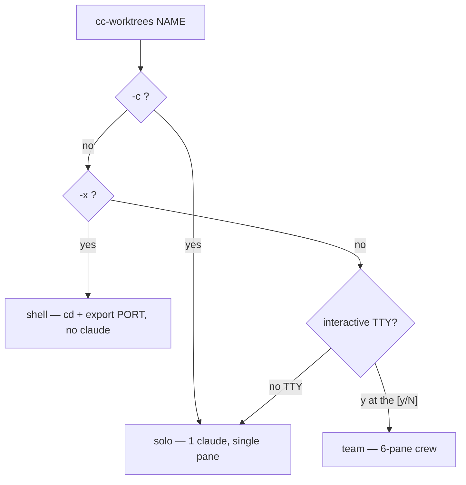
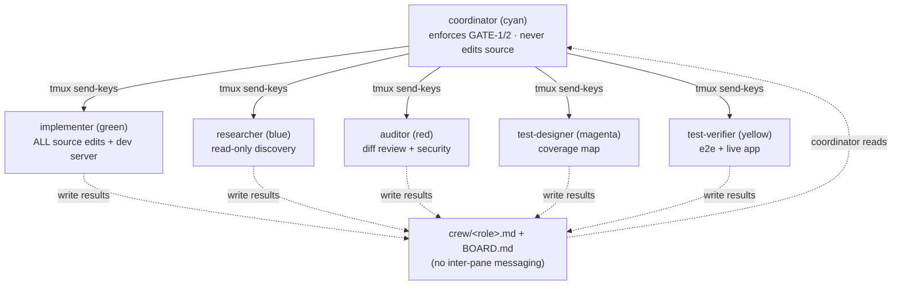

---
note-reader:
  - 7075cb2c7a6a39fabe031e2a6d5f12cf68cc553166e75120284de35101cd2e6c|17263
---

# cc-worktrees

> **BUILD-phase isolation & parallelism.** One git worktree per feature (a sibling of the repo),
> each on its own free port and its own tmux pane — optionally a full 6-pane Claude **crew** that
> runs the Design → Code → Prove spine for that worktree. A per-repo **test lock** serializes
> automated runs against the shared local stack. Works in _any_ git repo (`~/.local/bin/cc-worktrees`).

This is the isolation layer referenced throughout `WORKFLOW.md` (phase 3 BUILD / phase 7 FINISH).
It is a single **bash** script with no install step beyond putting it on `PATH` — but the crew/solo
modes require `tmux` (plus `git`/`lsof`/`awk`), and the Figma path additionally uses
`jq`/`node`/`bun`/`curl`/`osascript`.

---

## Quick start

```bash
cc-worktrees feat/login fix/crash     # 2 worktrees; each offers a 6-pane crew (after a y/N confirm)
cc-worktrees -c feat/login            # solo: one interactive claude in the worktree (no crew)
cc-worktrees -x feat/api              # shell only: cd + export PORT, no claude (lightweight)
cc-worktrees login                    # bare slug → branch "login", flat worktree dir
cc-worktrees -t feat a b              # category once → feat/a, feat/b
cc-worktrees ls                       # worktrees + reserved ports + test-lock holder
cc-worktrees test -- npm test         # run a command holding the per-repo test lock
cc-worktrees rm feat/login            # guarded remove (refuses dirty unless -f); keeps the branch
cc-worktrees init                     # scaffold .claude/worktrees.conf (autodetected)
cc-worktrees help                     # full usage
```

Each worktree lives at **`<repo>-worktrees/<name>`** — a _sibling_ of the main repo, never nested
(even when you run the command from inside another worktree). The tmux session is `ccwt-<repo>`.

**New branches base on the current `origin/<default>` (GATE 0, automatic).** Create first runs
`git fetch origin` and branches each new worktree off the freshly-fetched default branch — never the
local (often-stale) `main` — so you never start work behind origin. Override with `CCWT_BASE` (e.g.
`CCWT_BASE=origin/develop`, or `CCWT_BASE=HEAD` to base on your current checkout for stacked work).

---

## Commands

| Command                                                                      | What it does                                                                                                                                     |
| ---------------------------------------------------------------------------- | ------------------------------------------------------------------------------------------------------------------------------------------------ |
| `cc-worktrees [-c\|-x] [-b PORT] [-t CAT] [--review-dock] [--figma] <name>…` | Create worktree(s) + a tmux pane each. Default mode = **team** (6-pane crew).                                                                    |
| `cc-worktrees ls`                                                            | `git worktree list` + live port reservations + the per-repo test-lock holder.                                                                    |
| `cc-worktrees rm [-f] <name>…`                                               | Guarded remove: refuses a dirty worktree unless `-f`; on `-f` **backs up untracked/ignored files** (e.g. `.env`) first, archives `crew/*.md`, frees the port, prunes the empty category dir, **keeps the branch**. |
| `cc-worktrees test [--] <cmd>…`                                              | Run `<cmd>` while holding the per-repo test lock (a second `test` blocks until the first releases).                                              |
| `cc-worktrees figma <doctor\|up [--run-last]\|probe\|confirm> [ch…]`         | talk-to-figma bridge: the five guards, relay + Figma launch, and **live-channel proof** (see [Figma bridge](#figma-bridge-talk-to-figma)).       |
| `cc-worktrees init`                                                          | Write `.claude/worktrees.conf` with autodetected `SETUP`/`PROFILE`/`BASE_PORT`.                                                                  |
| `cc-worktrees help`                                                          | Usage.                                                                                                                                           |

### Create modes

| Mode               | Flag | Result                                                                                                                                |
| ------------------ | ---- | ------------------------------------------------------------------------------------------------------------------------------------- |
| **team** (default) | —    | After a `[y/N]` confirm, a **6-pane crew** opens in a window named after the slug. Non-interactive (no TTY) → falls back to **solo**. |
| **solo**           | `-c` | One interactive `claude` in the worktree, single pane, no crew.                                                                       |
| **shell**          | `-x` | Just a shell (`cd` + `export PORT`), no claude — the lightweight option.                                                              |



### Names

- `feat/login` → category/slug → branch `feat/login`, dir `<repo>-worktrees/feat/login`
- `login` → bare slug → branch `login`, flat dir `<repo>-worktrees/login`
- `-t feat a b` → apply category `feat` to bare slugs → `feat/a`, `feat/b`

### Flags

| Flag            | Scope  | Meaning                                                                                        |
| --------------- | ------ | ---------------------------------------------------------------------------------------------- |
| `-b PORT`       | create | Base port for the free-port search (default `3000`; in-use/reserved ports auto-skipped).       |
| `-t CAT`        | create | Default category applied to bare slugs.                                                        |
| `--review-dock` | create | Scaffold the dev-only in-page review dock (see below).                                         |
| `--figma`       | create | Scaffold the SVG→Figma bridge (see below). `FIGMA_SCAFFOLD=1` makes this the per-repo default. |
| `--no-figma`    | create | Skip the Figma scaffold even when `FIGMA_SCAFFOLD=1` makes it the per-repo default.            |
| `-f`            | rm     | Force-remove even with uncommitted/untracked changes (untracked + ignored files are backed up first — see safety). |

---

## The 6-pane crew

In team mode each worktree opens a window of six tiled panes. **Every pane is its own interactive
`claude` process** launched _as_ a canonical workflow agent (`claude --agent <name>`), **not** an
Agent-tool subagent. The **coordinator** drives the others by `tmux send-keys` to their panes and
reads their `crew/<role>.md` result files — there is no inter-pane messaging.

> **Crew-ops guardrails.** The recurring coordination frictions — no-idle-wait / coordinator autonomy
> (#107/#108), idle-pane triage, dev-port ownership across worktrees, fresh-keyed wait, and
> test-ownership partition — are drawn as decision diagrams in
> [`crew-workflow-guardrails.md`](crew-workflow-guardrails.md).

| Pane          | Launches as agent   | Border color | Role                                                                |
| ------------- | ------------------- | ------------ | ------------------------------------------------------------------- |
| coordinator   | `crew-coordinator`  | cyan         | Orchestrates the spine; enforces GATE-1/GATE-2; keeps every idle pane filled (no-idle-wait); never edits source. |
| implementer   | `crew-implementer`  | green        | Owns **all** source edits; runs the dev server on `PORT`.           |
| researcher    | `codebase-explorer` | blue         | Read-only discovery, `file:line` citations.                         |
| auditor       | `code-reviewer`     | red          | Adversarial `git diff` review + `/security-review`.                 |
| test-designer | `test-designer`     | magenta      | Coverage map (advisory; Read/Grep/Glob/Write only).                 |
| test-verifier | `playwright-tester` | yellow       | e2e specs + drives the live app @`127.0.0.1:PORT`.                  |



Each pane is launched with:

```bash
claude --name '<repo>-<slug>-<role>' --agent '<agent>' \
       [--model <CREW_MODEL>] [--permission-mode <CREW_PERMISSION_MODE>] [--effort <CREW_EFFORT>] \
       --append-system-prompt-file crew/prompts/<role>.md '<intro>'
```

The `--agent` gives the methodology/tools/model; the appended `crew/prompts/<role>.md` (generated
per worktree) gives the standing-pane coordination contract and the per-worktree wiring (`PORT`,
pane ids, paths).

### Crew helper scripts (scaffolded into `crew/`)

| File                            | Purpose                                                                                                                                                                                                                                                     |
| ------------------------------- | ----------------------------------------------------------------------------------------------------------------------------------------------------------------------------------------------------------------------------------------------------------- |
| `crew/dispatch.sh <pane> <msg>` | **Fire-and-verify** dispatch: sends the text and `Enter` as _separate_ events (a combined send gets absorbed into tmux bracketed-paste and silently sits unsubmitted), then verifies submission, re-pressing `Enter` up to 3×. Prints `dispatch OK`/`WARN`. |
| `crew/crew_wait.sh <files…>`    | Blocks until each result file carries a **fresh** `STATUS: DONE\|BLOCKED` sentinel. Fresh-keyed wait (#98): `CREW_WAIT_SINCE=<epoch>` requires mtime-after-dispatch and `CREW_WAIT_GREP=<regex>` requires a phase-marker line, so a result file reused across phases can't match a stale prior sentinel. **Run backgrounded** so the coordinator stays responsive. |
| `crew/crew_status.sh`           | Classifies each pane as `working` / `idle` / `STUCK` (unsubmitted) / `BLOCKED(perm)` (numbered MCP prompt) and prints the BOARD tail.                                                                                                                       |
| `crew/BOARD.md`                 | **Append-only** status heartbeat — every teammate appends on pickup and finish; the coordinator appends its "Current assignments". Never overwritten (concurrent writers + cross-session appends).                                                          |
| `crew/panes.env`                | Pane ids + `PORT` + per-role colors (sourced by the helpers). Ephemeral.                                                                                                                                                                                    |
| `crew/prompts/<role>.md`        | The generated per-role system prompt. Ephemeral.                                                                                                                                                                                                            |

`crew/` is **tracked in git** so the durable `*.md` records (BOARD, DESIGN, role results) survive
`cc-worktrees rm`; its own `crew/.gitignore` drops the ephemeral churn (`panes.env`, `*.ready`,
`*.done`, the helper scripts, `prompts/`).

---

## Configuration — `.claude/worktrees.conf`

`cc-worktrees init` autodetects and writes this; it is sourced on every create. All keys are optional.
The template's `setup.sh` is also a writer — it seeds this file at scaffold time (and persists
`STACK_PROFILE` / `TEST_CMD` / `RUN_CMD` below as the machine-readable source for `setup.sh --update`).
Because the file is sourced, command values are written escaped so an embedded quote or `$(…)` is stored
literally and never executed on create.

| Key                    | Default                                                                              | Meaning                                                                                                                                      |
| ---------------------- | ------------------------------------------------------------------------------------ | -------------------------------------------------------------------------------------------------------------------------------------------- |
| `SETUP`                | autodetect (`npm` if `package.json`, `py-editable` if `pyproject.toml`, else `none`) | First-run dependency install in the pane.                                                                                                    |
| `PROFILE`              | `web` (npm) / `non-web`                                                              | Project profile (cc-worktrees schema: `web` \| `non-web`).                                                                                   |
| `STACK_PROFILE`        | stack profile chosen at setup (`cli`; `web` for node)                                | `web` \| `service` \| `cli` \| `data` — the `docs/WORKFLOW.md` profile, distinct from cc-worktrees' `PROFILE` (which is derived from it). Persisted by `setup.sh`. |
| `BASE_PORT`            | `3000`                                                                               | Base for the free-port search (the `-b` flag overrides).                                                                                     |
| `TEST_CMD`             | —                                                                                    | Persisted by `setup.sh` at scaffold; machine-readable source for the `setup.sh --update` re-stamp (escaped on write; never auto-run here).   |
| `RUN_CMD`              | —                                                                                    | Persisted by `setup.sh` at scaffold; machine-readable source for the `setup.sh --update` re-stamp (escaped on write; never auto-run here).   |
| `CCWT_BASE`            | `origin/<default>` (auto)                                                            | Git ref new branches are based on. Auto-resolves to the freshly-fetched origin default; set `origin/develop`, a tag/sha, or `HEAD` (old local-HEAD behavior) to override. |
| `SETUP_CMD`            | —                                                                                    | Custom install command (overrides `SETUP`'s default).                                                                                        |
| `COPY_FILES`           | `.env .env.*`                                                                        | Gitignored files carried from the main checkout into each new worktree (patterns relative to root; idempotent).                              |
| `NESTED_INSTALL`       | `tests/e2e e2e` (npm)                                                                | Extra dirs with their own `package.json` to `npm install` on create, so the verifier never installs mid-pass.                                |
| `CACHE_WARM_CMD`       | —                                                                                    | Command run after install to warm regenerable caches (avoids cold/flaky first checks).                                                       |
| `DEV_SERVER_CMD`       | —                                                                                    | Opt-in: background-started in the implementer pane after install, then an `lsof` poll confirms it's up on `$PORT`.                           |
| `CREW_ARCHIVE`         | `1`                                                                                  | Archive `crew/*.md` (+ `design-import/`, `design/ref/`) to `<repo>/crew-archive/<branch>/` before `rm`.                                      |
| `CREW_MODEL`           | `claude-opus-4-8[1m]`                                                                | Model each crew agent launches with (`''` = inherit).                                                                                        |
| `CREW_PERMISSION_MODE` | `auto`                                                                               | `acceptEdits\|auto\|bypassPermissions\|default\|dontAsk\|plan`. Set `bypassPermissions` for MCP-heavy crews to avoid numbered-prompt stalls. |
| `CREW_EFFORT`          | —                                                                                    | `low\|medium\|high\|xhigh\|max` for each crew agent (`''` = inherit).                                                                        |
| `FIGMA_SCAFFOLD`       | `0`                                                                                  | `1` = scaffold the SVG→Figma bridge into **every** new worktree (per-repo default); override per worktree with `--no-figma`.                 |
| `FIGMA_SOCKET`         | `0`                                                                                  | `1` = on create, bring up the talk-to-figma relay (`:3055`) + launch Figma once.                                                             |
| `FIGMA_FILE_KEY`       | —                                                                                    | Optional `figma://` file key opened by `FIGMA_SOCKET` / `figma up`.                                                                          |
| `FIGMA_SOCKET_CMD`     | autodetect                                                                           | Relay start command (`''` = autodetect the `claude-talk-to-figma-mcp` clone's `bun run socket`).                                             |
| `FIGMA_RUN_LAST`       | `0`                                                                                  | `1` = best-effort ⌥⌘P "Run last plugin" on `figma up`/create (needs macOS Accessibility permission).                                         |

Environment: `CCWT_TESTLOCK_WAIT` (default `1800`) — max seconds a `test` run queues behind another
before giving up. Cache/lock state lives under `${XDG_CACHE_HOME:-~/.cache}/cc-worktrees`.

---

## Optional scaffolds

Both copy from a shared template store at `${XDG_DATA_HOME:-~/.local/share}/cc-worktrees/scaffold/`
(seed it once; missing store → the flag is a no-op with a notice). Neither ever overwrites an
existing file.

- **`--review-dock`** → `app/components/terminal/{ReviewDock.tsx,review-dock.css}` +
  `app/api/review-note/route.ts`. A dev-only, prod-gated in-page dock (with an element picker) that
  POSTs change-requests to `crew/REVIEW-NOTES.md` for the coordinator to action. Mount `<ReviewDock/>`
  in a dev-only layout.
- **`--figma`** → copies the full Figma toolkit into `scripts/` — the config-driven `figma-export.mjs`
  driver plus `page-to-svg.mjs`, `svg-to-figma.mjs`, `figma-page.mjs`, `probe-channels.mjs`,
  `capture-dialog.mjs`, `dom-to-svg.iife.js`, and `figma-export.config.example.json` — plus
  `docs/{figma-copy.md,FIGMA-EXPORT.md}`. The `svg-to-figma.mjs` path streams `set_svg` straight to the
  talk-to-figma relay (`ws://localhost:3055`), bypassing the agent output cap and the MCP 500 KB limit —
  the sharp page→SVG→Figma path.

---

## Figma bridge (talk-to-figma)

The `cc-worktrees figma` subcommand manages the [talk-to-figma] relay and **proves** a Figma plugin
is actually connected before you trust a channel. It exists because of one hard limit: **Figma has no
API to launch a plugin or read its channel from outside Figma**, so opening the plugin is the single
irreducible manual step (one click per window). Everything around it is automated.

```bash
cc-worktrees figma doctor              # run the five guards, report, non-zero exit on failure
cc-worktrees figma up [--run-last]     # ensure relay is up + launch Figma (+ FIGMA_FILE_KEY file)
cc-worktrees figma probe   <channel…>  # live-channel proof — get_document_info, real verdict
cc-worktrees figma confirm [channel…]  # prove + record CONNECTED channels into figma-export.config.json
```

### The five guards

| #   | Guard             | What it checks                                                                                                                                                                                                                                          |
| --- | ----------------- | ------------------------------------------------------------------------------------------------------------------------------------------------------------------------------------------------------------------------------------------------------- |
| ①   | **relay-up**      | The websocket relay is `LISTEN`ing on `:3055`; `figma up` starts it (`FIGMA_SOCKET_CMD` → clone's `bun run socket`) and polls until it binds, else fails loud.                                                                                          |
| ②   | **figma-app**     | Figma Desktop is installed before launching it.                                                                                                                                                                                                         |
| ③   | **devdeps**       | The SVG pipeline's `playwright` + `dom-to-svg` + `esbuild` and a Chromium build are present.                                                                                                                                                            |
| ④   | **live-channel**  | A channel returns **real `get_document_info` data** (`sender:"User"`), not a bare join-ack. The relay auto-creates a channel on _any_ join, so "joined / N join(s)" proves **nothing** — only a document reply does. This is the false-positive killer. |
| ⑤   | **accessibility** | The terminal can synthesize keystrokes (macOS Automation + Accessibility) — required for `FIGMA_RUN_LAST`'s ⌥⌘P. Probes with a harmless `fn`; only counts as a failure when `FIGMA_RUN_LAST=1`.                                                         |

### Channel capture

The plugin **auto-generates a new random channel on every connect** (shown in its panel as
"Copy the channel ID"). Two ways to record it:

- **Auto-discover** — `figma confirm` with **no args** greps the relay log for `joined channel: <id>`
  and proves each live. Works only for a relay **cc-worktrees started itself** (so it owns the log).
- **By id** — `figma confirm <id>` with the id pasted from the plugin panel.

Either way, only channels that pass the **live-channel** guard are written to
`scripts/figma-export.config.json` (`.channels`).

### `--run-last`

`figma up --run-last` (or `FIGMA_RUN_LAST=1`) sends ⌥⌘P ("Run last plugin") to Figma via AppleScript.
**Best-effort and fragile**: it needs macOS Accessibility permission for your terminal, only re-runs
whatever plugin ran _last_ (run Claude Talk to Figma manually once first), is per-window, and still
mints a new channel — so always follow with `figma confirm`.

[talk-to-figma]: the cursor-talk-to-figma plugin + socket relay on `:3055`.

---

## Concurrency & safety guarantees

- **Free-port allocation** — a lock-guarded atomic-`mkdir` mutex (crash-safe via PID-stale reclaim,
  no `flock`/`shlock` dependency) plus a reservation file with a 90 s TTL. No two worktrees collide
  on a port, even across different projects/sessions. The reservation bridges "chosen → dev server
  bound", after which `lsof` is authoritative.
- **Per-repo test lock** — `cc-worktrees test` holds a per-repo lock for the whole run, so two
  automated runs can't interleave on the shared local DB. `cc-worktrees ls` _surfaces_ the holder
  (it can't lock _you_ hand-testing, so it makes that case visible). A dead holder is auto-reclaimed.
- **Ownership-tracked teardown** — every pane is tagged `@ccwt_wt=<dir>` / `@ccwt_port=<port>`; `rm`
  only ever kills panes/sessions it owns, searches **all** windows (`-s`), frees the reservation, and
  reaps a leftover server still holding the port.
- **`rm` is guarded** — refuses a worktree with uncommitted/untracked changes unless `-f`. On `-f`
  it first **backs up untracked + ignored files** (e.g. `.env`, `panes.env`) to
  `~/.local/share/cc-worktrees/backups/<repo>/<name>/` — skipping regenerable junk (`node_modules`,
  `.next`, `.venv`, …) and the already-archived `crew/` — then archives `crew/*.md` and removes the
  worktree but **keeps the branch** (prints the `git branch -d` command).
- **Fresh base (GATE 0)** — create runs `git fetch origin` and branches each new worktree off the
  current `origin/<default>`, never the local (often-stale) `main`, so worktrees never start behind
  origin. Override with `CCWT_BASE`.
- **Env files carried in** — a worktree checks out _tracked_ files only, so gitignored `.env*` are
  copied from the main checkout (idempotent) so local dev works immediately. Pair this with
  `COPY_FILES` so local config lives durably in the main repo and propagates into every worktree —
  the robust complement to the `rm` backup safety net.

---

## File & directory layout

```
<parent>/
  <repo>/                          # main checkout
  <repo>-worktrees/
    feat/login/                    # a worktree (branch feat/login, own PORT)
      crew/                        # tracked; the crew's durable records
        BOARD.md  DESIGN.md  implementer.md  …   # *.md travel to git
        dispatch.sh  crew_wait.sh  crew_status.sh  panes.env  prompts/   # gitignored churn
  <repo>/crew-archive/<branch>/    # rm backstop (gitignored): crew/*.md + design-import/ + design/ref/

~/.cache/cc-worktrees/             # port lock + reservations + per-repo test locks
~/.local/share/cc-worktrees/scaffold/{review-dock,figma}/   # --review-dock / --figma templates
<repo>/.claude/worktrees.conf      # per-repo config (cc-worktrees init)
```

---

## See also

- **`WORKFLOW.md`** — the Design → Code → Prove spine cc-worktrees isolates the BUILD phase of.
- **`VERIFY-WORKFLOW.md`** — GATE-2 (run the suite via `cc-worktrees test -- …`, drive the live app).
- **`~/.claude/agents/crew-coordinator.md` / `crew-implementer.md`** — the bespoke crew agent defs.
- **`~/.claude/rules/agent-routing.md`** — which agent each crew pane launches as.
