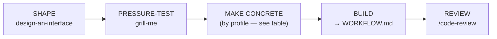
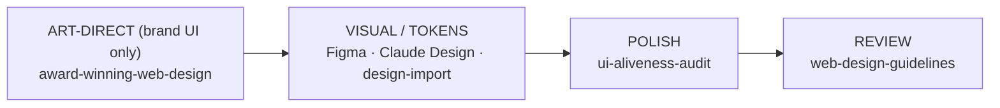
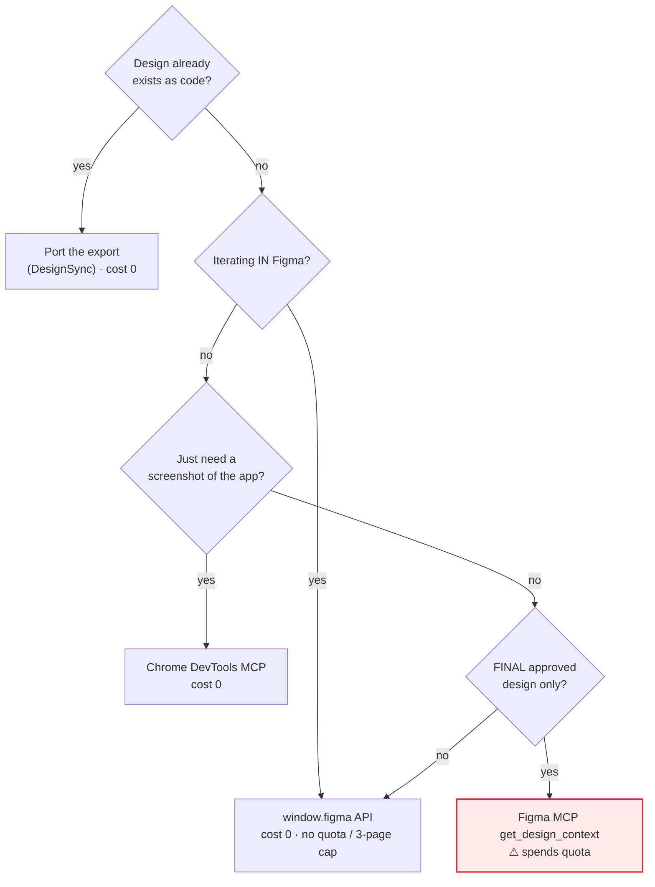

# Design Workflow (the _how_ of GATE 1)

The Design leg of **Design → Code → Prove** (`WORKFLOW.md`). This is _how_ you satisfy
GATE 1 — turn intent into a concrete, approved design before any implementation. A
`CLAUDE.md` instruction still wins, and the gate is never skipped. A design is **approved**
when shape + tokens + key states are concrete enough to build without guessing — then
`WORKFLOW.md` BUILD → VERIFY takes over. Run the stages that fit; skip what doesn't.

## The design pipeline (universal spine)

The spine is the same for every stack; the **MAKE CONCRETE** step is the only thing that changes by
profile (and only the Web-UI profile needs the visual machinery in the next section).

- **SHAPE** — `design-an-interface` ("Design It Twice": 3+ radically different designs, compared on simplicity/depth/misuse-resistance) → the chosen interface shape. This is the strongest fit for CLI/library/API work, where the "interface" _is_ the deliverable.
- **PRESSURE-TEST** — `grill-me` → severity-tiered flaws fixed _before_ you commit to a direction.
- **MAKE CONCRETE** — turn the chosen shape into something concrete enough to build without guessing:

  | Profile | "Concrete enough to build" means | Skills / artifacts |
  | --- | --- | --- |
  | **Web UI** | a rendered design — shape + tokens + key states, signed off on the actual pixels | the [Web-UI design pipeline](#web-ui-profile--art-direction-visual--tokens) below |
  | **Service / API** | the API contract — endpoints, request/response schemas, error shapes, status codes | OpenAPI / schema doc; example request/response pairs |
  | **CLI / Library** | the public interface — signatures, flags/args, exit codes, error types | the `design-an-interface` output; a usage/`--help` sketch |
  | **Data / Pipeline** | the data contract — input/output schema, partitioning, idempotency, lineage | schema doc; sample-in → sample-out fixtures |

- **BUILD** — domain skills (web: `frontend-design`) → production code. _(Hand-off: `WORKFLOW.md` BUILD → VERIFY ⛔ now owns it.)_
- **REVIEW** — `/code-review` (web also: `web-design-guidelines` UI-guidelines audit).

---

## Web-UI profile — art direction, visual & tokens

> _This whole section applies to the **Web UI** profile only._ Service/API, CLI/library, and data
> projects satisfy GATE 1 at "MAKE CONCRETE" above (a contract / interface / schema) and skip
> straight to BUILD — there are no pixels to approve.

The Web-UI MAKE-CONCRETE step has its own sub-pipeline:

- **ART-DIRECT** _(premium/brand sites only)_ — `award-winning-web-design` → a `concept.md` with real tokens + motion specs. Internal tools skip this.
- **SOURCE A LOOK / TOKENS** _(optional)_ — `design-import` (lift an existing site → tokenized HTML + React + `IMPORT.md`), **or** port a claude.ai/design / Figma-Make export, **or** pull tokens from Figma (table below).
- **POLISH** — `ui-aliveness-audit` → micro-feedback, loading/empty states, motion. **Every animation reduced-motion-gated.**

> **GATE-1 approves a RENDERED design, not a MECHANISM.** "Build frame 2:4 / mirror `DossierCard`" is a
> _build instruction_, not an approved look — building straight from it produces "that's not the design"
> reversals. Render the design to a **dev-only gated preview** (e.g. `/design-preview/<name>`),
> **screenshot desktop + mobile**, and get explicit human sign-off on _those pixels_ **before** wiring real
> routes/data. Approving a mechanism ≠ approving a design. _(Web-UI only — the analogue for an API is
> "approve the contract, not the handler"; for a CLI, "approve the `--help`, not the parser.")_

### Figma / Claude Design — quota-free first

**Never spend the Figma MCP quota (≈6 calls/month on Starter) on iteration — only on the final, approved design.** Ranked free → paid:

| Path                                                                                                   | Cost      | Fidelity                  | Use when                                                                                   |
| ------------------------------------------------------------------------------------------------------ | --------- | ------------------------- | ------------------------------------------------------------------------------------------ |
| **Port a Claude Design / Figma-Make export** (`DesignSync get_file` the React export → serve → render) | **0**     | exact (it _is_ code)      | the design already exists as code — the most faithful path                                 |
| **`window.figma` browser API** (`mcp__claude-in-chrome__javascript_tool`, logged-in tab)               | **0**     | exact (native plugin API) | iterating in Figma — bypasses the 6/month quota **and** the 3-page cap, unlimited          |
| **Chrome DevTools MCP / Playwright** (own browser, `http://127.0.0.1:PORT`)                            | **0**     | exact render              | screenshotting the live app — immune to the blocked extension (`local-browser-testing.md`) |
| **`html.to.design`** plugin (incl. localhost extension)                                                | **0**     | ~70-80%                   | bootstrap a running site → editable Figma layers for review                                |
| **Figma MCP `get_design_context` / `get_variable_defs`**                                               | **quota** | 95%+ semantic             | one-shot codegen / token-sync from the FINAL design (unlimited on a Dev seat)              |

Pick the cheapest path that hits the fidelity you need — only the **final, approved** design earns the quota:

Direction: `get_design_context` reads **Figma → code**; `use_figma` / `figma-generate-design` go **code → Figma**. Don't confuse them. `/design-sync` _pushes_ a repo design system **into** claude.ai/design (separate from reading a project via `DesignSync`).

> **The _how_ of this leg → `FIGMA-UI.md`.** When VISUAL/TOKENS means driving Figma — the two-bridge
> split (free arinspunk bridge vs. the metered official MCP), **Code Connect** (the highest-value lever
> to try first), the parallel-crew constraints, and the reverse **code → Figma mirror** (token sync and
> the A/B/C scripts) — `FIGMA-UI.md` is the playbook; `.claude/rules/figma-ui.md` the per-change checklist.

## See also

`FIGMA-UI.md` (Figma-MCP mechanics of VISUAL/TOKENS → BUILD) · `.claude/rules/figma-ui.md` (per-change checklist) · `agent-delegation.md` (delegate the parallel design exploration to subagents) · `local-browser-testing.md` (`127.0.0.1`, never the blocked Claude-in-Chrome extension).
