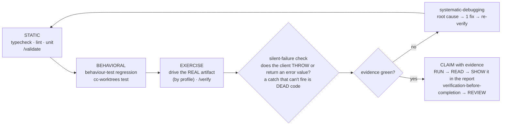

# Verify Workflow (the *how* of GATE 2)

The Prove leg of **Design → Code → Prove** (`WORKFLOW.md`). This is *how* you satisfy
GATE 2 — earn the word "done" with FRESH evidence THIS turn. The discipline: **RUN it →
READ it → SHOW it.** No "should / probably / seems" — run the check, read the real output,
and surface the evidence to the user. A suite the same agent just wrote is not independent
proof, and green unit tests ≠ "works" (drive the running app too). `CLAUDE.md` wins; the
gate is never skipped.

## The verify pipeline (fast → slow; run the WHOLE thing every cycle)

- **STATIC** *(seconds — fail fast)* — typecheck + lint + unit via `/validate` (or the project's command). Always-on, zero flakiness.
- **BEHAVIORAL** *(codified regression — run EVERY cycle)* — the behaviour-test suite for your stack (web: `e2e/*.spec.ts` via `playwright-tester`; `frontend-testing` for vitest; service: integration tests; CLI/lib: golden/property tests; data: fixture tests). Hold the per-repo lock: `cc-worktrees test -- <cmd>`.
- **EXERCISE** *(green ≠ works)* — start the artifact and drive the RUNNING thing: `/verify`. _How_ depends on the profile (table below). Codify anything you check by hand as a test.
- **ON FAIL** — `systematic-debugging` (root cause → ONE hypothesis → failing test → single fix), then re-run the WHOLE pipeline. Don't patch symptoms; ≥3 failed fixes → question the architecture.

### Drive the real artifact — by profile

| Profile | EXERCISE step | Evidence to capture |
| --- | --- | --- |
| **Web UI** | drive a browser @`http://127.0.0.1:PORT` with **Chrome DevTools MCP** (`webapp-testing`) — never the blocked Claude-in-Chrome extension (`local-browser-testing.md`) | screenshot / recording of the running app |
| **Service / API** | boot the service; hit endpoints (`curl`/`httpie`/HTTP client) | the request + real response (status + body); contract/schema assertion |
| **CLI / Library** | run the binary / call the public API | the command + its **stdout and exit code** (or returned value) |
| **Data / Pipeline** | run on fixture/sample data | output **schema, row counts, key metrics**; data-quality check output |

- **SILENT-FAILURE CHECK** — *best-effort ≠ unobservable.* For each `try/catch` around a client call, confirm the client actually *throws* on the failure mode — many (e.g. `supabase-js rpc()`) **return `{ error }` and do NOT throw**, so the `catch` is dead code and the error is silently dropped. Read the error and log a breadcrumb even when you intentionally continue. (Pairs with `silent-failure-hunter` at REVIEW.)
- **CLAIM** — only via `verification-before-completion`: the exact command + its real output, THIS turn, **and SHOW that evidence in your report** (a screenshot/response captured but never surfaced is half-wasted). GATE 2 passed → `WORKFLOW.md` REVIEW (`/code-review`, **distinct** from verify) takes over.

## What counts as "fresh evidence" (the only thing GATE 2 accepts)

| ✅ evidence | ❌ not evidence |
|---|---|
| command run THIS turn + its real output (`1446 passed in 12.3s`, exit 0) | "I ran it earlier / it should pass / the code looks right" |
| the evidence **shown in the report** — a screenshot of the RUNNING app (web) · the real HTTP response (API) · the CLI's stdout + exit code (CLI/lib) · output schema + row counts (data) | a test *description* with no run; mocked / asserted output; **evidence captured but never surfaced** |
| the failing test, now green after the fix | "all tests are green" with no command, count, or durations |

**Checklist before "done":** ran this turn · exit 0 · pass-count shown · nothing wrongly skipped/xfailed · no flaky/retry · real-artifact driven (web → live screenshot · API → response · CLI → stdout/exit · data → output asserted) · **evidence SHOWN in the report** · **no dead `try/catch` swallowing a returned error** · full suite re-run as regression (not a subset).

## See also
`verification-before-completion` (RUN→READ→SHOW) · `systematic-debugging` (4-phase root cause) · `/validate` · `/verify` · `local-browser-testing.md` (`127.0.0.1`, not the extension) · `agent-delegation.md` (delegate to playwright-tester / code-reviewer). Worked example — a 3-leg local gate with no CI: unit + lint, the e2e suite, and a live-app smoke, all green in-session before an admin-merge to `main`.
