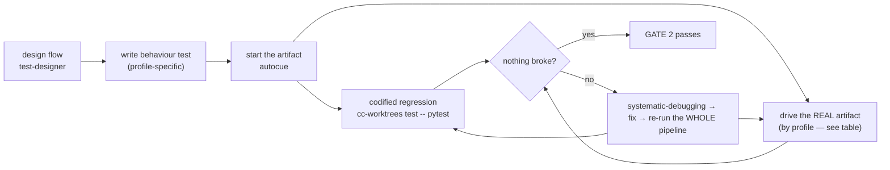
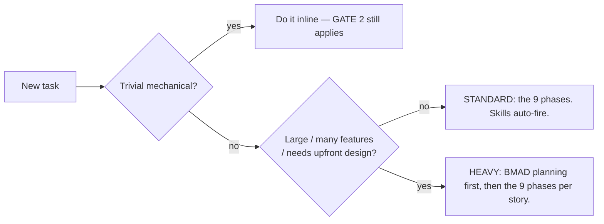
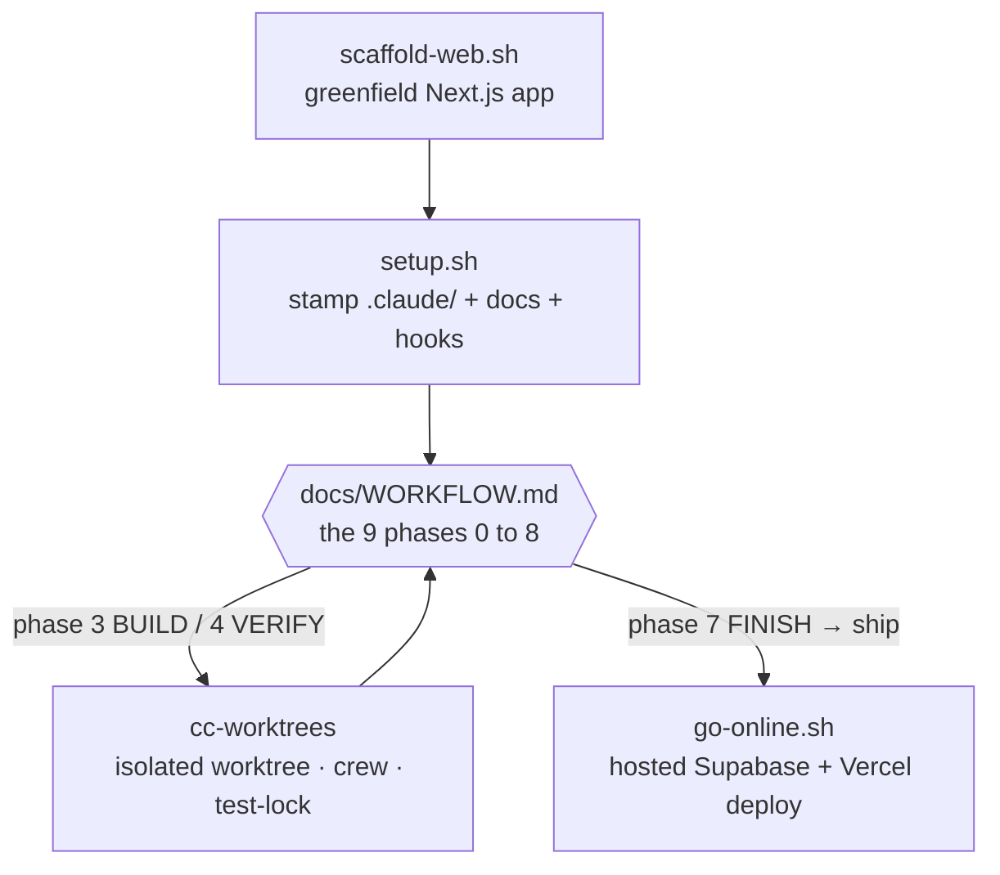
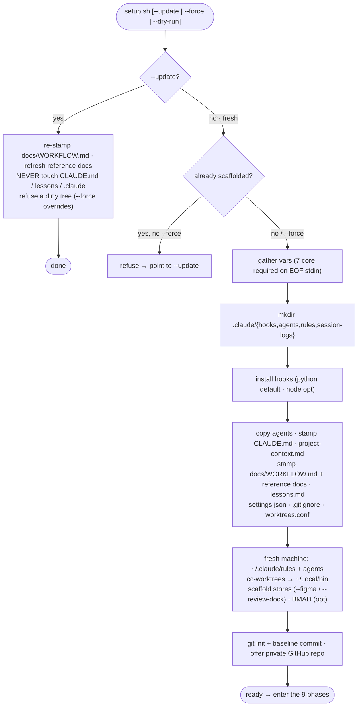
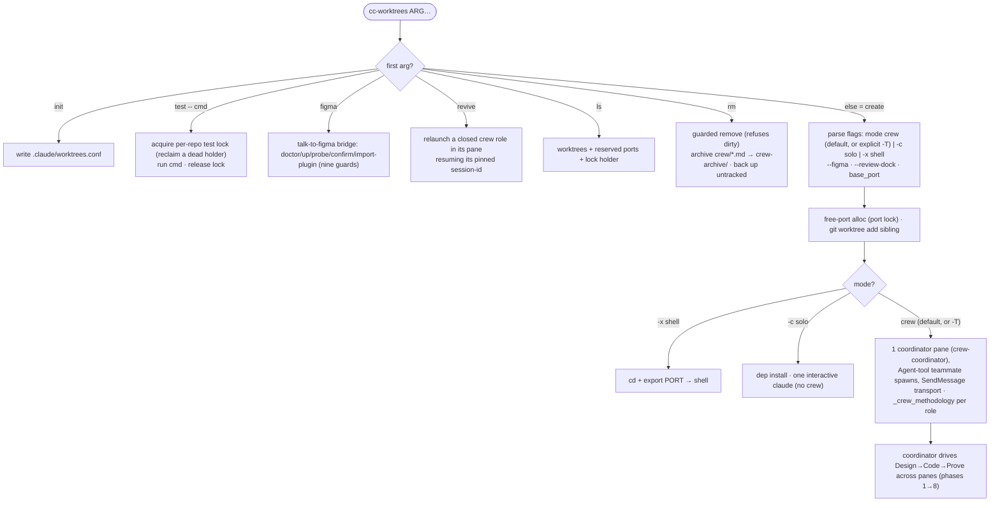
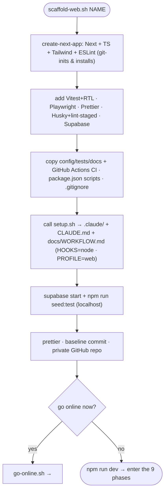
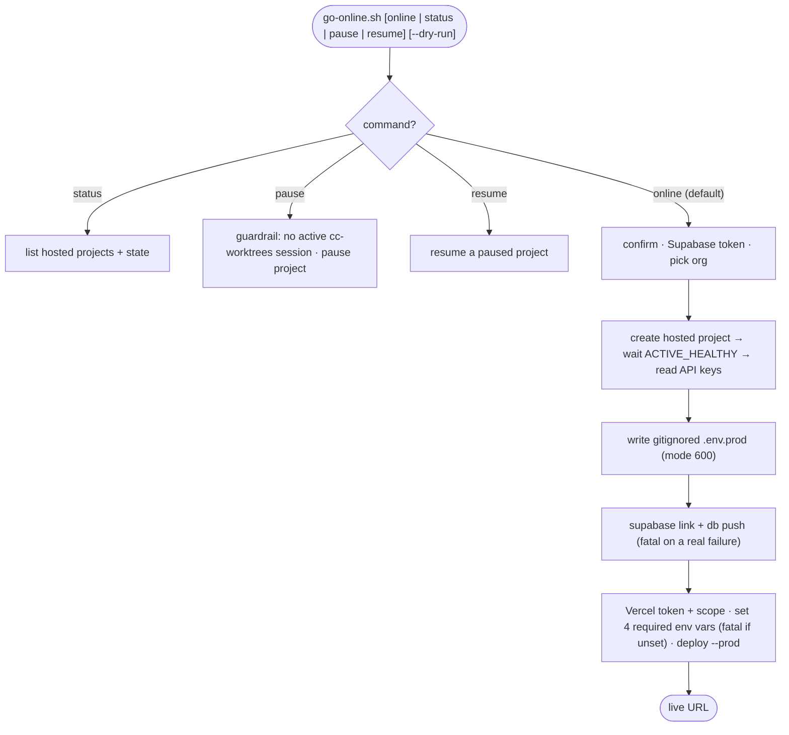
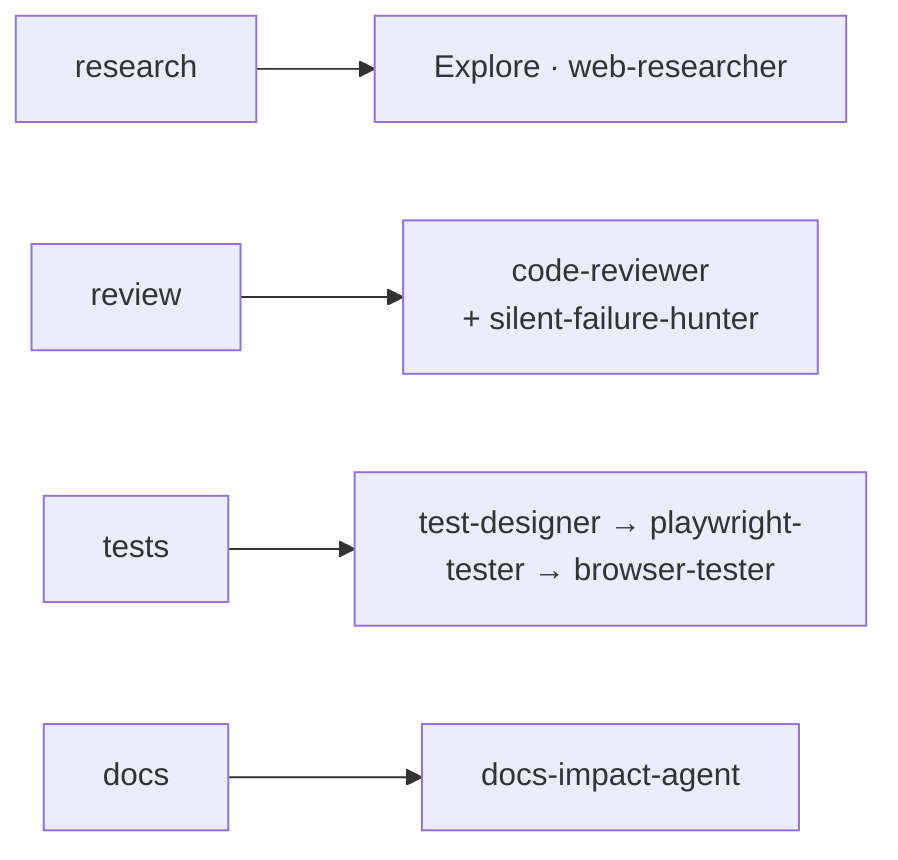

# Canonical Workflow

Last updated: 2026-08-10 01:49

> **THE LAW — Design → Code → Prove.** Shape it before you build it (GATE 1 ⛔), prove it
> with fresh evidence before you call it done (GATE 2 ⛔). Two hard gates, never skipped.
> The _how_ of the Design and Prove legs lives in `DESIGN-WORKFLOW.md` / `VERIFY-WORKFLOW.md`.

One workflow, every project — **any stack**. The discipline below is universal; the only thing
that changes by stack is _how you drive the real artifact_ (a web UI, a service/API, a CLI/library,
a data pipeline) — see the [profile table](#exercise-the-real-artifact-by-profile). Three layers
compose into a single lifecycle:

- **Superpowers** — the execution engine. Its skills auto-trigger (via the plugin's
  `SessionStart` hook) and enforce the discipline. You rarely invoke them by name.
- **BMAD** _(optional)_ — heavyweight upfront planning for large features (brief → PRD →
  architecture → self-contained story files) that feeds BUILD.
- **cc-worktrees** — isolation & parallelism for the BUILD phase (sibling git worktrees +
  a per-repo test lock).

Two laws override everything: a **`CLAUDE.md` instruction beats any skill**, and the **HARD GATES**
are never skipped.

> **Dev workflow vs. product/user workflow — don't conflate them.** *This* document is the **universal
> DEV workflow** (Design → Code → Prove) — it applies to every stack, including cc-worktrees itself.
> The **product/user workflow** — *what an end user does in the thing you're building* — is a separate,
> project-specific artifact and the SOURCE that feeds P2 test-design: for **web** projects it's
> `docs/USER-FLOWS.md` (the user journeys — created by `scaffold-web.sh`); for **CLI/library** projects it's the
> subcommands/public interface; for a **service** it's the API contract. Keep that artifact current —
> the dev workflow proves you built it right; the user-flow doc says what "it" is.

- **GATE 0 — Baseline before anything.** No design or code until you've synced to the current
  source of truth THIS session: `git fetch`, check the behind-count vs `main`, **rebase if behind**,
  and diff the live/deployed artifact (not a stale local snapshot). A feature branch is a snapshot in
  time — build on a stale one and you redo work that already exists. **Verify the plan/brief premise
  too**, not just the git base: have research characterize the target against live code and emit a
  `[EXISTS]/[PARTIAL]/[MISSING]` + file:line gap list; if it already exists, re-scope and re-enter
  GATE 1. A spawning plan is a hypothesis to falsify, not a contract. See [Phase 0](#phase-0--prime-the-baseline-first).
- **GATE 1 — Design before code.** No implementation until an approved design exists
  (`brainstorming`; or a BMAD PRD + architecture that passes the readiness gate).
- **GATE 2 — Evidence before "done".** No "done / fixed / passing" claim without FRESH
  output THIS turn — unit tests, typecheck, lint, AND the behaviour tests run against the
  **real artifact** (`verification-before-completion` + `/validate` / `/verify`). **SHOW the evidence
  in your report** — surface what proves it (screenshot for UI · response body for API · stdout/exit
  for CLI · output rows for data); evidence the user can't see is half-wasted.

## The 9 phases

```mermaid
flowchart TD
    P0["0 · PRIME — GATE 0 ⛔<br/>git fetch · behind-count vs main · rebase if behind<br/>diff the LIVE artifact · gh issue list (dup check) · /prime-core · /project-status"] --> G0
    G0{"GATE 0+ ⛔ — is the plan/brief premise still TRUE vs live code?<br/>research confirms what already exists (gap list)"}
    G0 -->|"stale — already built / wrong scope"| RS["RE-SCOPE<br/>narrow to the REAL gap · re-enter GATE 1"]
    RS --> P1
    G0 -->|"current"| P1
    P1["1 · SPEC — GATE 1 ⛔<br/>brainstorming auto · grill-me (required)<br/>Mermaid diagram of the design (required)<br/>/bmad-prd (heavy) · design doc → docs/superpowers/specs/"] --> P2
    P2["2 · PLAN + COVER (test-first)<br/>writing-plans auto → docs/superpowers/plans/<br/><b>test-designer</b> → coverage (Mermaid + checklist)<br/>write the FAILING test · run it alone → RED"] --> P3
    P3["3 · BUILD (red→green)<br/>cc-worktrees -c feat/x<br/>TDD auto · make the COVER test green<br/>domain skills (web: frontend-design · skill-authoring: superpowers:writing-skills)<br/>run the app/tool (autocue)"] --> P4
    P4{"4 · VERIFY — GATE 2 ⛔ — regression, EVERY cycle<br/>cc-worktrees test -- pytest (unit + behaviour)<br/>drive the REAL artifact (by profile — see below)<br/>typecheck · lint · /validate · /verify"}
    P4 -->|"red"| DBG["systematic-debugging auto"]
    DBG --> P4
    P4 -->|"green + artifact-verified"| P5["5 · REVIEW<br/>code-reviewer + silent-failure-hunter (req)<br/>code-simplifier + comment-analyzer (rec) · /security-review"]
    P5 -->|"panel changed code"| P4
    P5 --> P6["6 · DOCUMENT (impact)<br/><b>docs-impact-agent</b> → what did this change make STALE?<br/>update docs/ (ARCHITECTURE · README · TESTING) · /write"]
    P6 --> P7["7 · FINISH<br/>finishing-a-development-branch auto<br/>cc-worktrees rm feat/x · /merge-prs"]
    P7 --> P8["8 · CLOSE (docs-CLOSE) — GATE ⛔<br/>file follow-ups as GitHub issues or WORKFLOW:no-follow-ups<br/>HANDOFF/TASKS ← real PR#/merge state<br/>/handoff · /dev-reflect → docs/lessons.md<br/>/workflow-diagrams (best-effort)"]
    P8 --> Done([Done])
```



## Phase → tools

| #   | Phase               | Drives it (auto)                                                              | Commands / tools                                                                                                                                                                    |
| --- | ------------------- | ----------------------------------------------------------------------------- | ----------------------------------------------------------------------------------------------------------------------------------------------------------------------------------- |
| 0   | PRIME ⛔            | —                                                                             | **sync baseline first** (`git fetch` · behind-count vs `main` · rebase if behind) · **verify the plan premise vs live code** (gap list) · `gh issue list` (already tracked? avoid dup work) · `/prime-core` · `/project-status` · context-map |
| 1   | SPEC ⛔             | `brainstorming`                                                               | **grill-me (required)** · **Mermaid diagram (required)** · `/bmad-prd` · `/bmad-create-architecture` (heavy) · **see `DESIGN-WORKFLOW.md`**                                                                                         |
| 2   | PLAN + COVER (test-first) | `writing-plans`                                                         | **test-designer** (behaviour / user-flow coverage) · **write the failing test** (the project test-writer — `playwright-tester` for web `e2e/*.spec.ts`) · **run JUST that test** (`cc-worktrees test -- <it>`) → confirm **RED** (rest of suite stays green; ⚠ NOT `/validate` — that's the full-suite green gate at P4) · `/bmad-create-story` · **see `DESIGN-WORKFLOW.md` COVER** |
| 3   | BUILD (red→green)   | `test-driven-development` · `executing-plans` · `subagent-driven-development` | **cc-worktrees** · make the COVER red test green; add tests as code grows · domain skills (web: `frontend-design` · skill-authoring: **`superpowers:writing-skills`**, which also verifies the skill before deploy at P4)                                                                                          |
| 4   | VERIFY ⛔           | `verification-before-completion` · `systematic-debugging`                     | `cc-worktrees test -- pytest` (unit + behaviour) · **drive the real artifact** (by profile — see below) · typecheck/lint · `/validate` · `/verify` · **see `VERIFY-WORKFLOW.md`** |
| 5   | REVIEW              | `requesting-code-review` → `receiving-code-review`                            | **required:** code-reviewer (=`/code-review`, run one) + silent-failure-hunter · **recommended:** code-simplifier + comment-analyzer · `/security-review` · **panel edits → re-run VERIFY**                                                                                                         |
| 6   | DOCUMENT (impact)   | —                                                                             | **docs-impact-agent** → what did this change make STALE? · `/write` · create-readme · architecture-blueprint (heavy: BMAD Paige)                                                    |
| 7   | FINISH              | `finishing-a-development-branch`                                              | `cc-worktrees rm feat/x` · `/merge-prs`                                                                                                                                             |
| 8   | CLOSE (docs-CLOSE) ⛔ | —                                                                           | **file every follow-up / known gap / deferred nit as a GitHub issue** (`gh issue create`), or state `WORKFLOW:no-follow-ups` — enforced by the `close_issue_gate` Stop hook · HANDOFF/TASKS ← real PR#/merge state · `/handoff` · `/dev-reflect` · **`/workflow-diagrams`** (best-effort — skip headless) · remember |

## Behaviour tests (design → write → run as regression)

Behaviour — the real flows your artifact promises — is first-class, not an afterthought. Design
the flows AND write the first failing test at COVER (PLAN/P2), turn it green in BUILD, and run them
**every VERIFY cycle** so nothing silently breaks. Two layers, both run every cycle:



- **Codified regression** — automated tests that fail loud if a flow breaks; run locally via
  `cc-worktrees test -- pytest` and in CI.
- **Real-artifact verification** — green tests ≠ "works"; drive the _running_ thing (the "real
  behaviour, not just green" check). _How_ you drive it depends on the stack — see below.

### Exercise the real artifact (by profile)

Everything above is universal; this is the one leg that changes by stack. **This project's profile:
`cli`** (set in `.claude/worktrees.conf` → `STACK_PROFILE`). Pick the matching row:

| Profile | Drive the real artifact in VERIFY | Behaviour test lives in |
| --- | --- | --- |
| **Web UI** (frontend / full-stack) | start the app, drive a browser @`http://127.0.0.1:$PORT` with **Chrome DevTools MCP** (`webapp-testing`; never the Claude-in-Chrome extension — see `local-browser-testing.md`); screenshots as evidence | Playwright `e2e/*.spec.ts` |
| **Service / API** (HTTP/RPC backend, no UI) | boot the service on a port, hit endpoints (`curl`/`httpie` or an HTTP client) and assert status + body/contract/schema | integration tests against the running server |
| **CLI / Library** (tool or importable package) | run the binary / call the public API; assert **stdout + exit code** / return values; run the documented examples | unit + golden/property tests; runnable example scripts |
| **Data / Pipeline** (ETL / analytics / ML) | run the pipeline on fixture/sample data; assert output **schema, row counts, metrics**; data-quality checks | fixture-driven pipeline tests |

Codify anything you verify by hand as a test. The web row is the canonical example because the
template's `scaffold-web.sh` ships it end-to-end; the other rows follow the same RUN→READ→CLAIM
discipline (`VERIFY-WORKFLOW.md`).

## Phase 0 — PRIME the baseline first

**GATE 0 ⛔ · _Sync, don't assume._** A feature branch / worktree is a **snapshot in time**. Build on a stale one and you redo work that
already exists, verify against the wrong baseline, and let merge conflicts compound. **Before any
design or code, establish the current source of truth THIS session:**

```bash
git fetch origin
git rev-list --count HEAD..origin/main   # BEHIND? >0 ⇒ sync (rebase) before building
git rev-list --count origin/main..HEAD   # AHEAD?  ⇒ what's local-only
# + open / screenshot the LIVE deployed artifact as the reference — not a stale local
```

- **If behind > 0 → sync first.** Solo/unpushed branch ⇒ `git rebase origin/main`; **shared/pushed**
  branch ⇒ `git merge origin/main` (rebase rewrites history — don't force it on teammates).
- **Dirty tree first:** a rebase won't run dirty — commit/stash, and back up untracked work that
  could collide with paths `main` now tracks.
- **The deployed/running artifact is the source of truth** — not a stale local, not a mockup. Diff
  it before deciding anything "doesn't match."
- **Verify the plan/brief premise, don't just obey it.** GATE 0 covers the *plan's claims*, not only
  the git base — a plan/PRD is a snapshot too. Before any build, characterize the plan's target
  surface against live code and emit a tagged gap list (`[EXISTS]` / `[PARTIAL]` / `[MISSING]` +
  file:line). If the target (or part of it) already shipped, **re-scope to the real gap and re-enter
  GATE 1** — bring the corrected scope to the user before writing code. Don't rebuild shipped work.
- **An installed CLI can silently drift from its source.** Before trusting `cc-worktrees`'s live
  behavior, diff the INSTALLED copy (`~/.local/bin/cc-worktrees`) against the repo's own
  `bin/cc-worktrees` — an install that predates the latest commit runs stale logic with no warning.
- **A "clean" main can be hiding orphaned WIP.** Before treating `main` (or a sibling worktree) as a
  clean baseline, scan it for orphaned staged/uncommitted work — `git status` and `git stash list` —
  in both `main` and any sibling worktrees; a crashed/abandoned session can leave WIP that a fresh
  `git fetch` + behind-count check alone won't surface.

## How much process? (the decision)



## cc-worktrees (BUILD-phase isolation)

```bash
cc-worktrees -c feat/login      # solo claude in an isolated worktree on its own port
cc-worktrees -x feat/api        # just a shell (cd + export PORT)
cc-worktrees add feat/impl2     # worktree ONLY (branch+PORT+env, no session/claude) — how a crew
                                #   coordinator provisions an extra implementer's worktree (#162)
cc-worktrees ls                 # worktrees + reserved ports + test-lock holder
cc-worktrees test -- pytest  # run tests holding the per-repo lock (serializes runs)
cc-worktrees rm feat/login      # remove (refuses dirty unless -f)
```

Use it for 2+ independent features or to keep `main` pristine. Always run automated suites via
`cc-worktrees test -- <cmd>`. `-c`/`-x` are the verified-safe modes.

**Coordinating a multi-pane crew?** The crew-ops guardrails — idle-pane triage, dev-port ownership
across worktrees, fresh-keyed wait, and test-ownership partition — are drawn as decision diagrams in
[`crew-workflow-guardrails.md`](crew-workflow-guardrails.md).

## How the entry scripts execute (and where they sit in the workflow)

The template ships four executable entry points. Three **bootstrap** a project (they run once, before
the 9 phases begin); `cc-worktrees` is the **runtime engine** that drives BUILD/VERIFY; and
`go-online.sh` **ships** the result. This map shows how each connects to the phases above:



### `setup.sh` — bootstrap the workflow into a project _(before phase 0)_

The clone-and-run entry point: stamps `.claude/` + `docs/WORKFLOW.md` + hooks so every project runs
_this_ workflow. Idempotent — a plain re-run on an established project refuses (pointing at `--update`,
which refreshes only the canonical docs and never touches `CLAUDE.md`/`lessons.md`/`.claude/`).



### `cc-worktrees` — BUILD/VERIFY isolation engine _(phases 3–4; drives 1–8 in crew mode)_

The runtime engine referenced throughout the phase table. Subcommand-dispatched; the default (no
subcommand) creates an isolated sibling worktree and, by default, a crew whose coordinator
runs the full Design→Code→Prove spine. `cc-worktrees test --` holds the per-repo lock used in VERIFY.



### `scaffold-web.sh` — greenfield web app + workflow layer _(before phase 0; web profile)_

An alternate bootstrap for a brand-new Next.js app: builds the toolchain (test · e2e · lint · CI ·
Supabase), then delegates to `setup.sh` for the `.claude/` layer, so a fresh app lands ready for phase 0.



### `go-online.sh` — take it to production _(post-FINISH; phase 7–8 adjacent)_

Provisions hosted Supabase and deploys to Vercel. Not part of the inner loop — it's the ship step
after the workflow has produced something worth deploying (and is offered at the end of `scaffold-web.sh`).



## Conventions & file locations

- **`project-context.md`** — the BMAD "constitution"; produced at GATE 1, loaded by every agent.
- **`docs/superpowers/specs/`** + **`docs/superpowers/plans/`** — design specs + TDD plans (auto-written).
- **the behaviour-test suite** — the codified regression (web: `e2e/*.spec.ts`; service: integration
  tests; CLI/lib: golden/property tests; data: fixture-driven tests) — kept green every VERIFY cycle.
- **`docs/`** — `ARCHITECTURE.md`, `TESTING.md`, `WORKFLOW.md`, **`lessons.md`** (the canonical
  lessons-learned log, appended by `/dev-reflect`); keep current in the DOCUMENT / CLOSE phases.
- **`_bmad-output/`** — BMAD artifacts (heavy track). **`.git/sdd/progress.md`** — SDD ledger.
- **Worktrees:** `cc-worktrees` is canonical (siblings `<repo>-worktrees/<name>`); clean up with
  `cc-worktrees rm`, gitignore `.worktrees/` and `worktrees/`.

## Delegation

Delegate substantial work to in-process subagents (see `~/.claude/rules/agent-delegation.md`):
research → Explore / web-researcher; review → code-reviewer (+ silent-failure-hunter); tests →
test-designer → playwright-tester → browser-tester; docs → docs-impact-agent. Trivial things stay inline.



> **Local vs global agents.** `setup.sh` copies **all** of this repo's `agents/*.md` into every
> scaffolded project's `.claude/agents/` — both the generic reviewers/researchers (code-reviewer,
> code-simplifier, codebase-explorer, comment-analyzer, docs-impact-agent, pr-test-analyzer,
> silent-failure-hunter, type-design-analyzer, web-researcher) **and** the crew + flow agents named
> above (`crew-coordinator` (crew, the only crew mode)/`crew-implementer`, `test-designer`, `playwright-tester`). They also live
> machine-globally in `~/.claude/agents/` (installed via `sync-agents.sh`), so they resolve whether or
> not you're inside a scaffolded project. As of the plugin POC there is also a **third, optional
> delivery path**: the same `agents/*.md` are packaged as a Claude Code plugin, so a machine/sandbox
> can `claude plugin install claude-template@claude-template` under a scoped namespace instead of the
> `setup.sh` copy (additive — see README's "Install the agents plugin"). `Explore` is a built-in agent
> type; `browser-tester` is not a separate agent file — it's the live-driving **role** played by
> `playwright-tester` + the `webapp-testing` skill.
