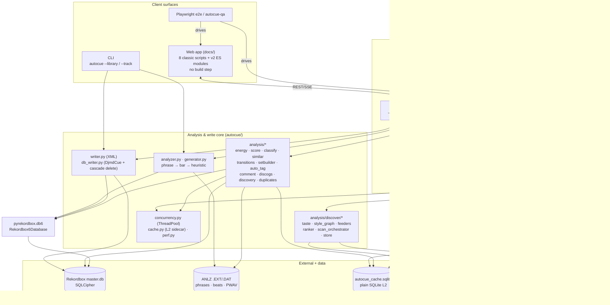
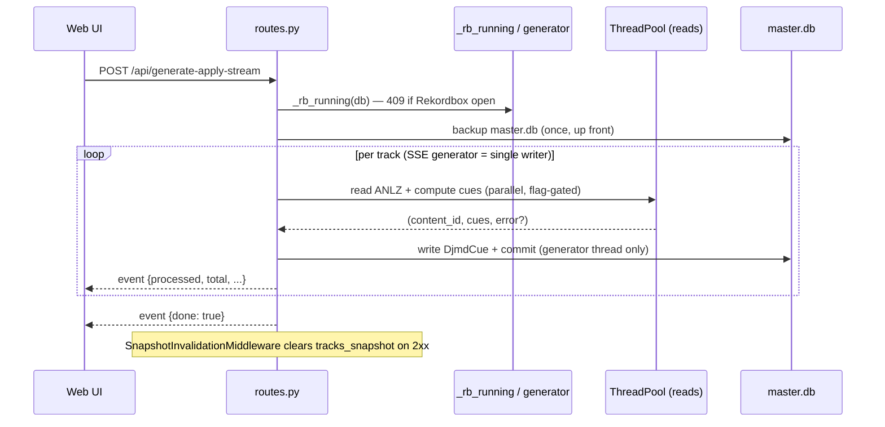
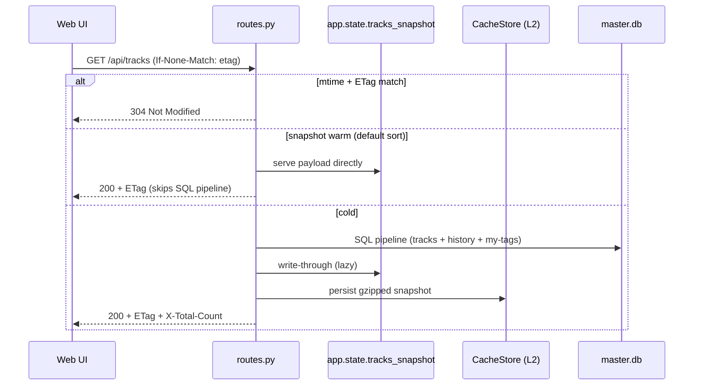
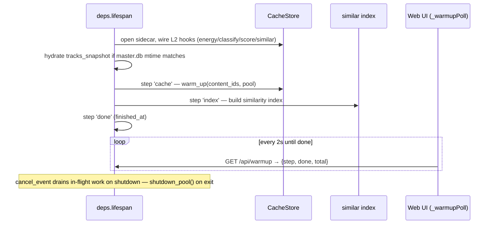

# Architecture Blueprint: AutoCue

> **Generated overview** — a big-picture, human-onboarding view of the system,
> synthesized from the codebase and verified against source. The **canonical**
> AI-context docs remain `CLAUDE.md` and `.claude/project/*` (architecture,
> db-constraints, api-design, web-ui, analysis-and-testing); when this file and
> those disagree, those win. Diagrams are [Mermaid](https://mermaid.js.org/) —
> GitHub renders them inline; locally, `mmdcat docs/architecture-blueprint.md`.

## System Overview

AutoCue is a DJ-library intelligence tool that automatically places hot cues on
Rekordbox 7 tracks and analyses a library across **three surfaces sharing one
Python core**: a **CLI** that reads Rekordbox's encrypted database + ANLZ files
directly and emits an importable XML; a **local FastAPI server** (`autocue serve`,
`localhost:7432`) that reads/writes `master.db` directly and exposes every
intelligence feature over a REST/SSE API; and a **build-step-free web app**
(`docs/`) that is the UI in local mode and a frozen XML-in/XML-out tool when
served statically from GitHub Pages. The defining constraint is that **Rekordbox
must be closed** for any write (the DB is SQLCipher-locked while open), and the
defining performance pattern is a **shared thread-pool + L1/L2 cache hierarchy +
mtime-keyed snapshot** layered on top without ever violating the single-writer
rule for `master.db`.

## Component Diagram

## Components

### CLI (`autocue/cli.py`, `__main__.py`)
- **Purpose**: Batch-generate hot cues and emit a Rekordbox-importable XML; no server, no intelligence features.
- **Interface**: `autocue --track/--track-id/--library [--playlist NAME] [--overwrite] [--dry-run] [--output FILE] [--db-path PATH]`; the `serve` subcommand forks into the server path (`--port`, `--no-browser`, `--reset-cache`).
- **Data**: Reads `master.db` + ANLZ; writes an XML file (default `autocue_import.xml`). Never writes the DB.
- **Flow**: resolve target → `generate_cues_for_track` (phrase→bar→heuristic) → skip already-cued tracks unless `--overwrite` → `write_xml`.

### FastAPI server (`autocue/serve/`)
- **Purpose**: The full product. Serves the web UI as static files and exposes the read/write/intelligence API against the live Rekordbox DB.
- **Location**: `serve/app.py` (factory + uvicorn launcher), `deps.py` (lifespan/DI), `routes.py` (~90 endpoints), `schemas.py` (Pydantic), `middleware.py` (snapshot invalidation).
- **Interface**: REST + SSE under `/api/*`; `StaticFiles` mount at `/` serving `docs/`.
- **Deployment**: `uvicorn.run(..., host=127.0.0.1, port=7432)`; port-in-use detection reuses an existing AutoCue server or walks the next 9 ports; opens the browser via a 1s timer.

### Cue generation core (`analyzer.py`, `generator.py`, `models.py`)
- `analyzer` reads ANLZ `.EXT` (PSSI phrases) + `.DAT` (PQTZ beat grid); `generator` runs the **phrase → bar → heuristic** fallback and smart slot ordering (A = first mix-in phrase, B = first outro, C+ by `_SMART_PRIORITY`).
- `CuePoint` dataclass (slot 0-indexed A–H; `-1` = memory cue), `PhraseLabel` enum, `GenerationPrefs`.

### Writers (`writer.py`, `db_writer.py`)
- **`writer.py`**: serializes `CuePoint`s to Rekordbox XML via `pyrekordbox.rbxml` (CLI + Pages mode). XML import is slot-level additive.
- **`db_writer.py`**: writes `CuePoint`s directly to `DjmdCue` (`Kind = slot+1`; explicit `generate_unused_id`); enforces `rekordbox_is_running()` (psutil name probe + exclusive file-lock); backs up before writes; `delete_tracks()` cascades **all 13 ContentID-bearing tables** before deleting `DjmdContent`.

### Analysis modules (`autocue/analysis/`)
Each is a focused analysis unit with an in-process **L1 cache** and an optional **L2** `CacheStore` hook via `set_cache_store()`:

| Module | Responsibility |
|---|---|
| `energy.py` | PWAV → normalized 0–1 energy curve + profile classifier |
| `score.py` | Mixability score 0–100 (intro/outro bars + energy variance + vocal proxy) |
| `classify.py` | Track category: warmup/build/peak/after_hours/closing |
| `similar.py` | Cosine similarity on a 6-dim vector; module-level lock-guarded index |
| `transitions.py` | `score_transition(a,b)` → BPM/key/energy compatibility + `transition_advice` |
| `setbuilder.py` | Beam search (width 5) set construction + `build_alternatives` |
| `auto_tag.py` | Writes Rekordbox My Tags (`DjmdMyTag`/`DjmdSongMyTag`); reversible runs |
| `comment.py` | MIK-compatible comment enrichment into `DjmdContent.Commnt` (rewritable sentinel) |
| `discogs.py` / `discovery.py` | Discogs client (token-bucket 60 rpm) + new-release suggestions |
| `duplicates.py` | Pure detector: `(artist,title,duration_bucket)` grouping + keeper picking |
| `quality.py` | Cue-quality health scoring (pure DB reads) |

### Discover v2 (`autocue/analysis/discover/`)
Self-contained recommendation subsystem: `taste` + `style_graph` → `feeders/` (artist/label/novelty, budget locked at 20/15/10) → `ranker` → `scan_orchestrator` (concurrent-scan lock, 120s wallclock soft-cap) → `store`. Surfaced under `/api/discover/*`.

### Infrastructure (`concurrency.py`, `cache.py`, `perf.py`)
- **`concurrency.py`**: process-singleton `ThreadPoolExecutor` (`min(8, cpu_count())`, `AUTOCUE_POOL_SIZE`). **Single-writer invariant**: the pool does read/compute only; the SSE generator loop is the sole `master.db` writer.
- **`cache.py`** (L2): `autocue_cache.sqlite` sidecar (plain SQLite, WAL, no secrets/audio). 6 tables keyed `(content.ID, anlz_mtime)`; `MISSING_MTIME=-1` sentinel; schema-version mismatch drops+recreates.
- **`perf.py`**: `perf_span` ring buffer, zero-overhead unless `AUTOCUE_PERF=1`.

### Web app (`docs/`)
- **No build step, no framework.** `index.html` (markup) + `css/app.css` + **8 ordered classic scripts** `js/01-core.js … 08-set-builder-boot.js` (shared global scope) + **`js/v2/` ES modules** rooted at `v2/main.js`. Interop is one-way: v2 reads legacy via `window.ACBridge`, exposes via `window.AC2`; legacy never imports v2.
- **2.0 "Crate Console" workbench** (local-mode default): rail **places** (Library, Duplicates, Discover — mutually exclusive centre-pane swaps) + ⌘K palette + crates; **Nightboard** is a full-bleed set-canvas *mode*. The Cues/Library/Discover tab bar is retired (`#tab-group` CSS-hidden); `switchTab` survives as load-bearing place-swap plumbing.
- **External deps** (CDN only): Tailwind, Google Fonts (Inter), jsmediatags.

## Data Flow Diagrams

### Generate-and-apply (the core write path, SSE)

### Library load with snapshot fast-path

### Startup warm-up pipeline (lifespan daemon thread)

## Technology Stack

| Layer | Choice | Rationale |
|---|---|---|
| Core language | Python ≥3.10 | pyrekordbox is Python; direct ANLZ/DB access |
| Rekordbox access | `pyrekordbox.db6.Rekordbox6Database` | Decrypts SQLCipher `master.db` + parses ANLZ |
| Web framework | FastAPI + uvicorn | Async SSE streaming for long fanouts; trivial static mount |
| Validation | Pydantic (`schemas.py`) | Typed request/response contracts |
| L2 cache | plain SQLite (WAL) | Regenerable, no secrets; fast cold-start hydration |
| Concurrency | `ThreadPoolExecutor` singleton | I/O-bound ANLZ reads; preserves single-writer DB rule |
| Frontend | Vanilla JS, no build step | Static/Pages-deployable; classic scripts + ES-module seam |
| Optional download | yt-dlp + ffmpeg (`[download]` extra) | Lazy-imported so core install stays slim |
| Enrichment | Discogs API | Style/genre tags + new-release discovery |
| Python tests | pytest (+ httpx, Hypothesis) | property tests for math |
| JS tests | Vitest + jsdom | functions copied verbatim from source |
| E2E | Playwright (`tests/e2e/`) | Catches CSS/layout/place-swap regressions jsdom can't |

## Deployment Architecture

- **Process model**: single uvicorn process on `127.0.0.1:7432` (CORS limited to `null` / `localhost` / `127.0.0.1` — never widen; the server writes the DB). One shared thread pool; one daemon warm-up thread. No external services, containers, or brokers — it runs on the DJ's laptop.
- **Startup**: `autocue serve` → port probe (reuse-or-fallback) → `create_app()` installs GZip → CORS → SnapshotInvalidation middleware, mounts `docs/` static, runs the lifespan (open DB, wire L2, hydrate snapshot, spawn warm-up).
- **Pages**: `docs/` served statically at `https://henrigeorge.github.io/AutoCue/` (XML-in/out only, **frozen** — no intelligence features without `autocue serve`).
- **No CI**: GitHub Actions removed intentionally (billing). Merge gate is the **local three-leg stack** — `pytest` + `npm test` (Vitest) + Playwright e2e — run green before every PR merge. Do not re-add workflows.
- **Branch discipline**: never commit to `main` (a pre-commit hook blocks it); all changes land via worktree branch → PR → `gh pr merge`.

## Key Design Decisions

1. **Single-writer rule under parallelism** — every multi-track endpoint fans reads/compute across the shared pool, but only the SSE generator loop commits. Pinned by `test_concurrency_invariants.py`. Parallel paths ship behind `AUTOCUE_PARALLEL_*` flags — now **default-on** (TASK-008 verified 2026-06-07), except `/api/auto-tag/discogs` which stays opt-in.
2. **L1/L2/snapshot cache hierarchy keyed by file mtime** — in-process LRU (L1) + SQLite sidecar (L2, keyed `(content.ID, anlz_mtime)`) + mtime-keyed tracks snapshot with ETag/304. Self-invalidating because Rekordbox rewrites ANLZ/DB mtime; `/api/restore` calls `invalidate_all()`, and HTTP middleware clears the snapshot on any 2xx mutation.
3. **No build step, ever, for the web app** — classic scripts preserve original `app.js` order via a shared global scope; all *new* code is ES modules behind a strict one-way `window.ACBridge`/`window.AC2` seam. Keeps the app Pages-deployable and frameworkless while allowing incremental modernization.
4. **Rekordbox-closed enforced at two layers** — psutil process-name probe *plus* an exclusive file-lock attempt on `master.db`, checked at every write endpoint (`_rb_running`). Process name alone misses renamed builds and the start-after-probe race.
5. **Destructive delete cascades all 13 ContentID tables** — verified against a real in-memory SQLite schema (`test_duplicates_integration.py`) that fails if pyrekordbox adds a new ContentID table; protected by per-session backup window + per-row savepoint + concurrency lock + `/api/restore`.
6. **Honest scoring over free wins** — missing energy data scores neutral 50 (not 100), capping no-ANLZ transitions; similarity caps at 0.65 without ANLZ. Defeats the old "every same-key/BPM pair scores 100" failure mode.
