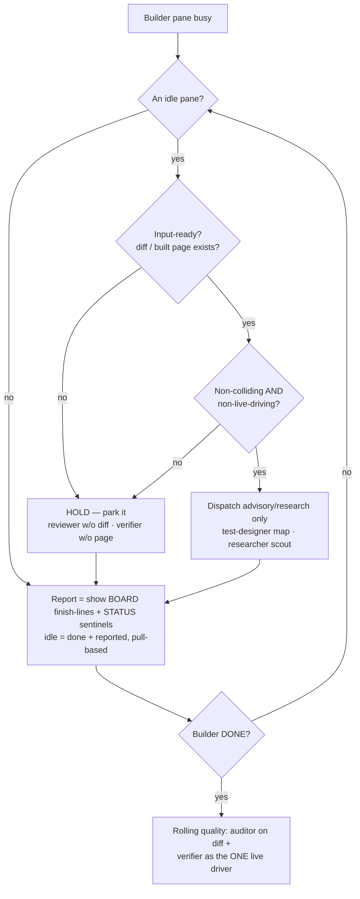
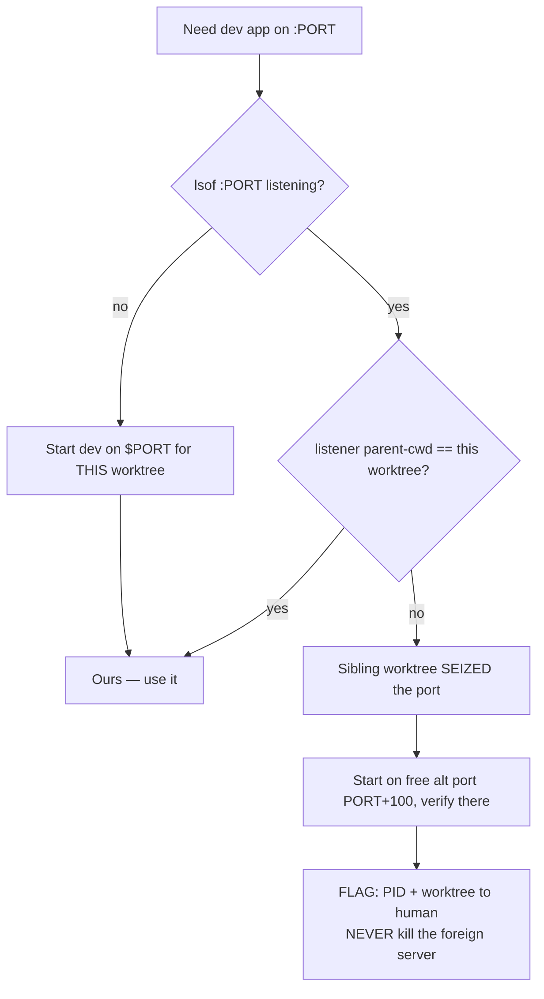
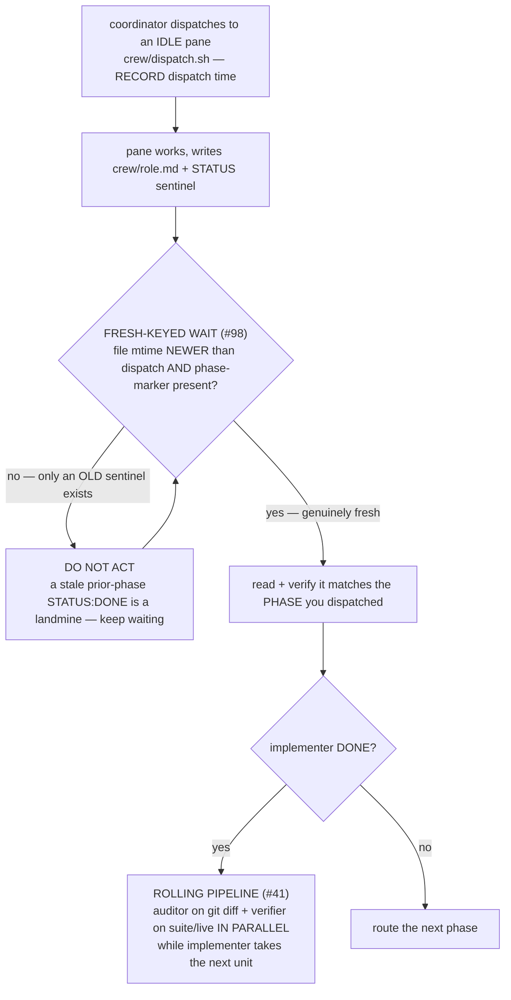
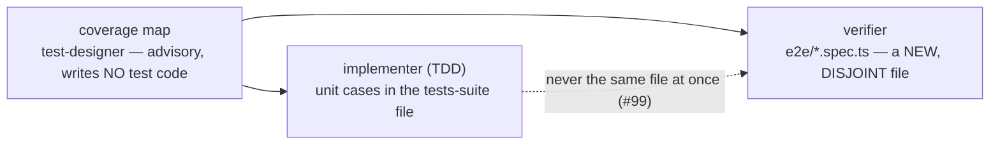

# Crew workflow guardrails

Decision diagrams that turn a `cc-worktrees` crew session's recurring frictions into **branch logic**.
A retrospective lesson in [`lessons.md`](lessons.md) records *what* went wrong; the diagram below makes
the failure mode structurally hard to repeat. These are **crew-mechanism** guardrails — they apply when
a multi-pane crew is running, and live alongside the coordinator methodology in
[`../bin/cc-worktrees`](../bin/cc-worktrees) (`_crew_methodology`). The universal spine stays in
[`WORKFLOW.md`](WORKFLOW.md) / [`VERIFY-WORKFLOW.md`](VERIFY-WORKFLOW.md).

Inline Mermaid is canonical here (the repo's docs convention — no committed images).

| Guardrail | Encodes |
|---|---|
| D1 · Coordinator dispatch loop | #96 idle-pane triage · #26 one live driver · #105 pull-based reporting |
| D2 · Dev-port ownership across worktrees | #103 |
| Dispatch & fresh-keyed wait | #98 |
| Test-ownership partition at P3 | #99 |

---

## D1 — Coordinator dispatch loop

While the single build pane runs a long task, the coordinator must neither leave every other pane idle
(wasted parallelism) nor "keep them busy" by dispatching every phase at once — a reviewer with **no diff**
or a verifier pointed at the **builder's live server** is worse than idle. Dispatch only INPUT-READY,
non-colliding, non-live-driving phases; HOLD the rest; surface the pull-based report trail so a
finished-and-logged pane doesn't read as stalled; roll quality the moment the builder is DONE.

Encodes **#96** (idle-pane triage — front-load only input-ready, non-colliding, non-live-driving phases;
HOLD the rest), **#26** (one live driver at a time), and **#105** ("idle" ≠ "silent" — render the
pull-based report trail so finished panes don't look unresponsive).

---

## D2 — Dev-port ownership across worktrees

Run multiple worktrees/crews in parallel and two dev servers default to the same port; the second to
start can **seize** it, so `:PORT` silently serves the *other* worktree's app — verification then asserts
against the wrong codebase (a 404 on a route only your branch has). Detect by IDENTITY (the listener's
parent-cwd), verify on your OWN free port, and FLAG — the naive "kill whatever's on the port" clobbers a
concurrent human session.

Encodes **#103** (a sibling worktree can seize your dev port — detect by identity, verify on your own
port, flag never clobber).

---

## Dispatch & fresh-keyed wait

The crew-ops failure: a pane reused one result file across P3→P4, and the wait matched the **stale P3
sentinel** and returned instantly — nearly reporting P4 "done" off an old line. The guard: wait until the
file's **mtime is newer than the dispatch** AND a **phase-marker** is present; only then read + verify it
matches the dispatched phase. A sentinel is fresh only if the file changed AFTER you asked. The
`crew_wait.sh` helper enforces this via `CREW_WAIT_SINCE` (mtime) + `CREW_WAIT_GREP` (phase marker).

Encodes **#98** (fresh-keyed wait — never act on a stale prior-phase `STATUS: DONE`).

---

## Test-ownership partition at P3

When the implementer (TDD) and the verifier both produce tests, split by file so they never collide:

Encodes **#99** (partition test ownership by file — `git diff --name-only` confirms zero overlap;
extends the single-code-owner rule to the test layer).
