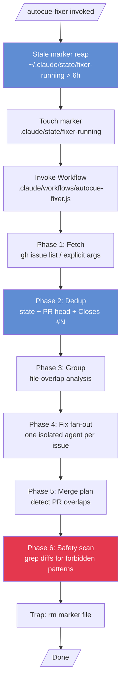
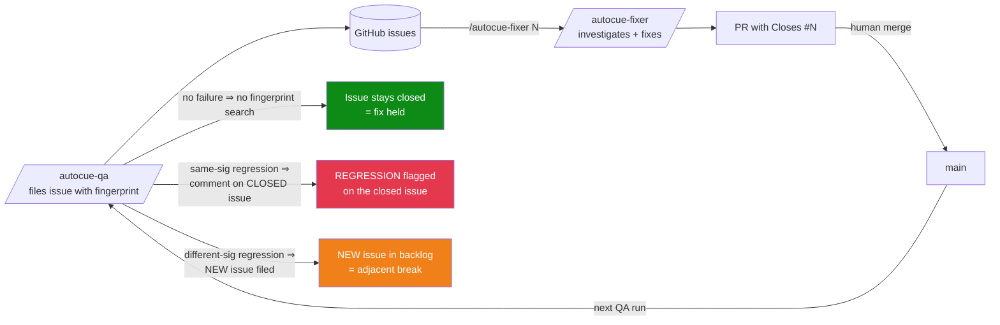
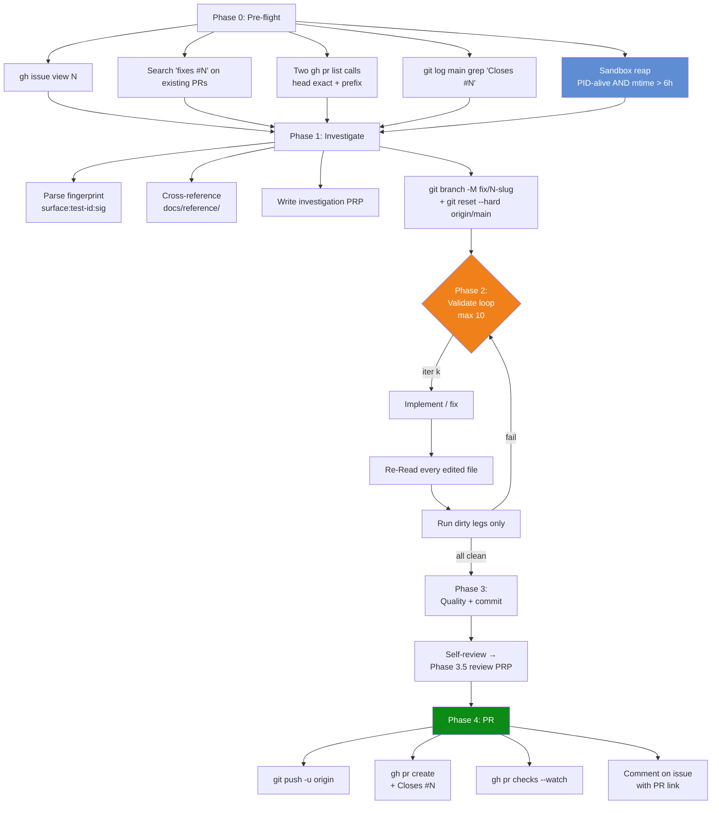
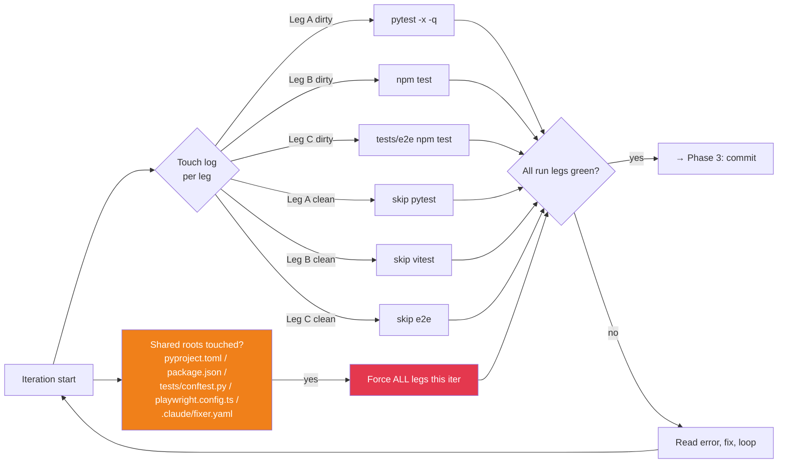
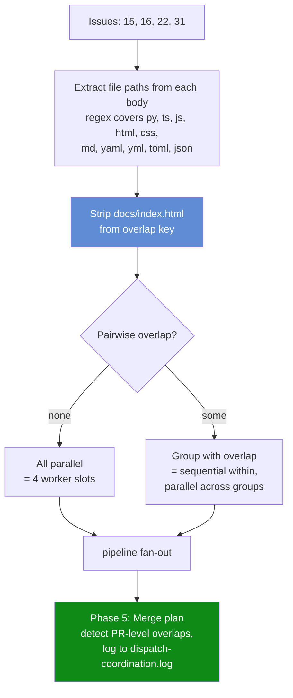
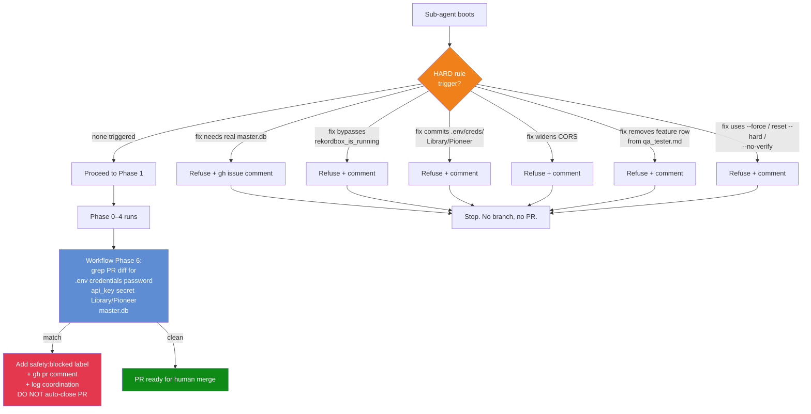
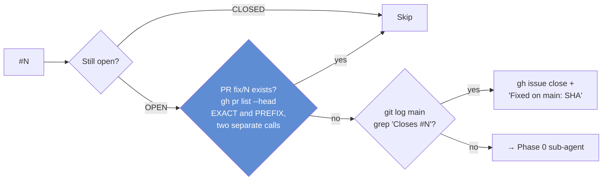

# QA Fixer (`/autocue-fixer`)

Companion to [`/autocue-qa`](./qa_tester.md). The QA agent files issues with
stable fingerprints; the fixer turns those issues into PRs. Two halves of the
same loop.

```text
/autocue-fixer             # all open `bug`-labelled issues
/autocue-fixer 16          # one issue
/autocue-fixer 15 16       # several specific issues
/autocue-fixer --dry-run   # plan only; no `gh` writes, no `git push`
```

There is no `scripts/dispatch.sh`. The slash command, a sub-agent prompt, and
a single Workflow script are the entire mechanism.

---

## 1. End-to-end run



---

## 2. Closed loop with `/autocue-qa`

The load-bearing semantics: the QA agent's dedup logic only **searches** for
a fingerprint when a failure is detected.



- **Silence on the closed issue** = the fix held.
- A `Reoccurred on …` comment on the closed issue = same-signature regression
  (the exact `abrupt-eof` came back).
- A brand-new issue with the same `<surface>:<test-id>` but a different `<sig>`
  = a regression in the same family but a different failure class. Monitor
  both paths.

---

## 3. Per-issue agent — Phase 0 → 4

Each per-issue fix-worktree runs the sub-agent at
`.claude/agents/autocue-fixer.md`. Spawned via the Workflow's
`agent(..., { isolation: "worktree" })` so the worktree is brand new and the
branch is fresh.



### Phase 2 — three test legs, touch-log skip



---

## 4. Workflow dependency grouping

The Workflow groups multiple issues by **file overlap** so parallel agents
don't collide. `docs/index.html` is **excluded from the overlap key** because
every UI bug names it — grouping on it would serialize the most common bug
class.



---

## 5. Safety preflight (HARD rules)



The post-fix safety scan in the Workflow is **independent of the agent's
self-assessment**. LLM agents can violate HARD rules; the deterministic grep
catches it post-hoc.

---

## 6. Issue dedup — the three checks



Why TWO `gh pr list --head` calls? Because `gh` honours only one `--head` per
invocation. The first matches `fix/<N>` exactly; the second matches the
prefix `fix/<N>-` for slug-suffixed branches.

---

## 7. Hooks

The fixer relies on hooks already registered in `.claude/settings.json`:

| Hook | Event | Purpose for the fixer |
|---|---|---|
| `pre_tool_use_branch_check.py` | PreToolUse | Blocks commits on `main`. Trust it. |
| `safe_git_add.sh` | PreToolUse (Bash) | Blocks `git add -A`. Trust it. |
| `stop_log.py` | Stop | Logs unpushed-work reminders. **Optional bypass.** |

### Optional `stop_log.py` bypass

If `stop_log.py`'s reminder text starts polluting agent context during fixer
runs, add this snippet at the top of `.claude/hooks/stop_log.py` (the hook
lives outside git):

```python
from pathlib import Path
if Path(".claude/state/fixer-running").exists():
    raise SystemExit(0)
```

The slash command body already creates `.claude/state/fixer-running` before
the Workflow runs and deletes it in a trap. The marker is a filesystem flag
— any process (parent slash command, Workflow runner, sub-agents) sees the
same answer. Whether the project Stop hook fires on sub-agent Stops is
runtime-dependent; the marker works regardless.

---

## 8. PRP artifact lifecycle

Each fix writes three files under `.claude/PRPs/`:

- `issues/<num>-<slug>.investigation.md` — root cause + proposed solution
- `reviews/<num>-<slug>.review.md` — self-review verdict + verification
- `reports/<num>-<slug>.report.md` — changes + tests + validation summary

These are **tracked in git** because they're evidence on the PR.
**Squash-merge preserves the files** but loses the per-iteration commit
chronology — that's the chosen tradeoff (per-iter trail is rarely useful
post-merge; the artifacts themselves are).

Periodic cleanup (~monthly): move resolved artifacts to
`.claude/PRPs/archive/YYYY-MM/` so the live directories don't pile up.

---

## 9. Where things live

| Concern | File |
|---|---|
| Slash command | `.claude/commands/autocue-fixer.md` |
| Sub-agent prompt | `.claude/agents/autocue-fixer.md` |
| Workflow script | `.claude/workflows/autocue-fixer.js` |
| Config | `.claude/fixer.yaml` |
| Marker file (runtime) | `.claude/state/fixer-running` (gitignored) |
| Stop hook bypass (optional) | `.claude/hooks/stop_log.py` |
| Coordination log | `.claude/reports/dispatch-coordination.log` |
| PRP artifacts | `.claude/PRPs/{issues,reviews,reports}/` |
| User doc (this file) | `docs/qa_fixer.md` |
| Companion doc | `docs/qa_tester.md` |

---

## 10. Maintenance

- When `docs/reference/` changes a documented behavior, the corresponding
  fingerprint stops firing and the fixer's investigation artifact will note
  the doc as the source.
- When CI changes test commands (new lint step, etc.), update
  `.claude/fixer.yaml` `test_cmd_*` keys.
- Coordination log noise: archive `.claude/reports/dispatch-coordination.log`
  periodically; it grows unboundedly.
- If `safe_git_add.sh` rejection rate spikes, audit the agent prompt — it
  probably learned to retry with `-A`, which is wrong.
