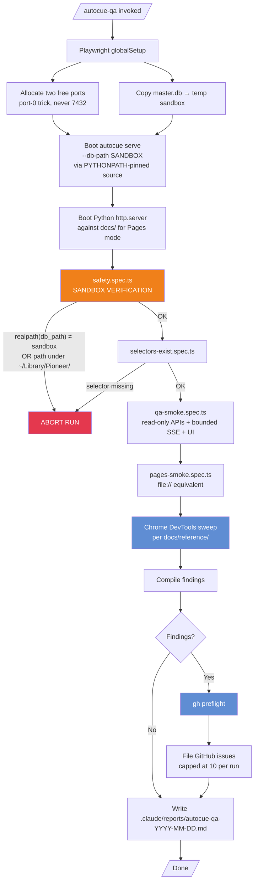
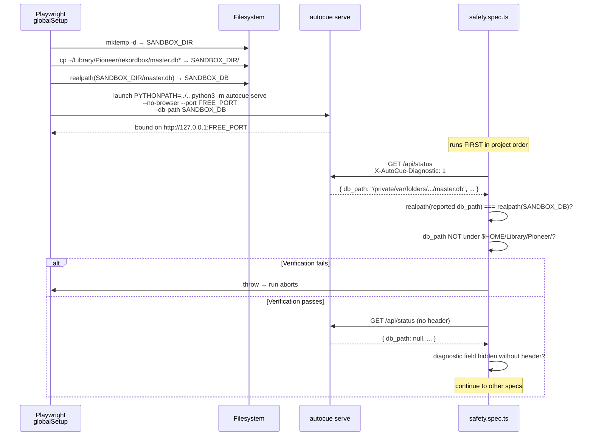
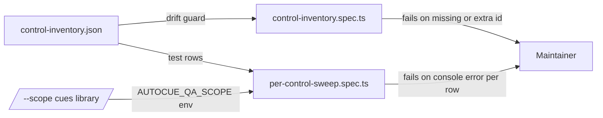
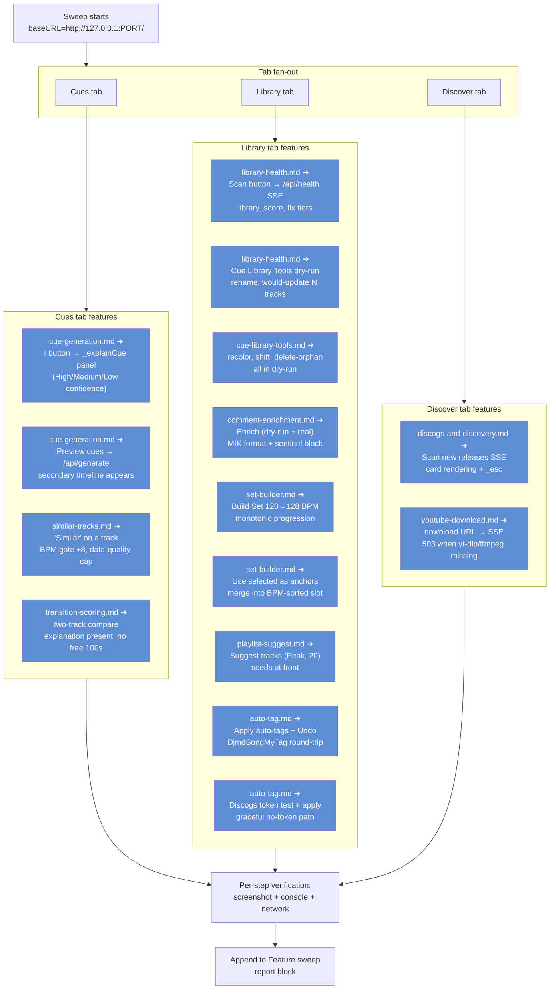
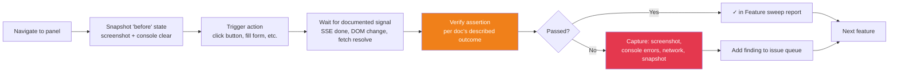
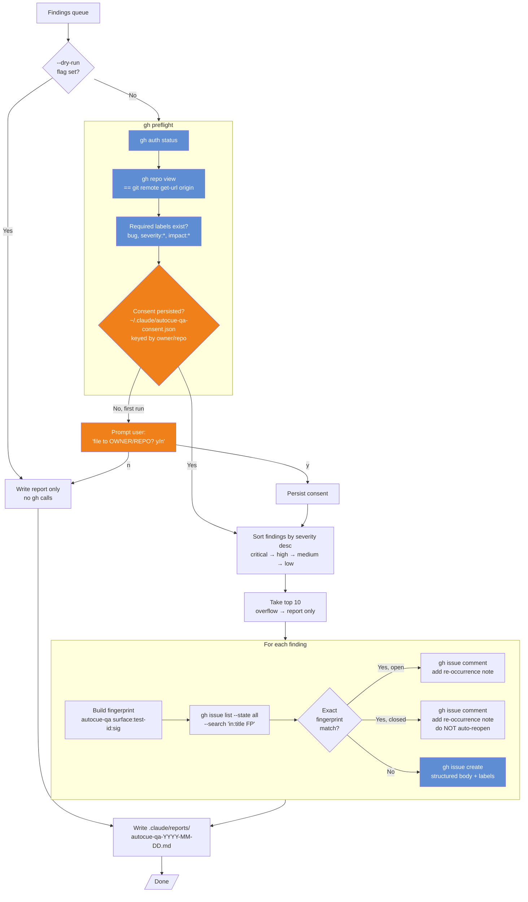

# QA Tester (`autocue-qa`)

The `autocue-qa` sub-agent is AutoCue's automated end-to-end QA harness. Every
invocation boots a sandbox server, runs the Playwright smoke layer, drives the
live UI through Chrome DevTools using the reference docs in
`docs/reference/` as the test specification, and files GitHub issues for any
failures.

Invoke it with the slash command:

```text
/autocue-qa             # full run; files issues by default (after first-run consent)
/autocue-qa --dry-run   # write the report only; skip all `gh` calls
```

The agent prompt lives at `.claude/agents/autocue-qa.md`. The browser-driven
spec files live under `tests/e2e/`.

---

## 1. End-to-end run

The high-level flow on every invocation.



---

## 2. Safety preflight

AutoCue's Apply path writes directly to `master.db`. The harness MUST never
touch the user's real library. The safety contract is enforced at three
layers and aborts the run on any mismatch.



The `db_path` diagnostic field only appears when the request carries
`X-AutoCue-Diagnostic: 1`. The web UI never sets it; only the QA harness
does.

---

## 3. Playwright smoke layer

The Playwright suite verifies plumbing — does the page load, does the
endpoint return 2xx, does the SSE stream emit `data:` and terminate. It is
deliberately shallow: feature semantics are the DevTools sweep's job.

```mermaid
flowchart LR
    subgraph Smoke ["qa-smoke.spec.ts"]
        S1[GET /api/status]
        S2[GET /api/playlists]
        S3[GET /api/tracks]
        S4[GET /api/tags]
        S5[GET /api/backups]
        S6[GET /api/config]
        S7[GET /api/download/config]
        S8[GET /api/health?limit=5<br/>bounded SSE]
        S9[UI load — no console errors]
        S10[Tab switch — Cues / Library / Discover]
        S11[Filter toggles — phrase, beats, search]
    end
    subgraph Pages ["pages-smoke.spec.ts"]
        P1[http://127.0.0.1:PAGES_PORT/index.html]
        P2[#tab-nav must NOT be visible<br/>localhost mode detection failed = correct]
        P3[No console TypeErrors<br/>/api/status probe failure allowlisted]
    end
    subgraph Sel ["selectors-exist.spec.ts"]
        SL[14 canonical selector IDs<br/>fail loudly if any missing]
    end

    Sel --> Smoke
    Smoke --> Pages
```



`qa-full.spec.ts` is a stub gated by `RUN_FULL=1` — it covers write
endpoints against the sandbox DB and is intended for opt-in runs only.

---

## 3a. Per-control sweep

Behavioural layer between the smoke and the Chrome DevTools feature
sweep. Each interactive control with a stable id in `docs/index.html`
gets its own Playwright test row.



Three artifacts under `tests/e2e/`:

| File | Job |
|---|---|
| `control-inventory.json` | Source of truth. Three keys: `globalControls`, `panelControls.{cues,library,discover}`, `perTrack`. |
| `control-inventory.spec.ts` | Drift guard. Enumerates live DOM (after clearing inline `display: none` on every section), diffs against the inventory, fails with one id per line in two sections. |
| `per-control-sweep.spec.ts` | One Playwright `test()` per inventory row. v1 covers presence + click/focus + no console error. `AUTOCUE_QA_SCOPE` env var (`cues,library,discover`) filters panels; global controls always run. |

### Adding a new control — 3 steps

1. **Append a row** to `tests/e2e/control-inventory.json` in the right array (`globalControls`, or `panelControls.cues/library/discover`). Required fields: `id`, `kind`. Optional: `collapsible: [...]` (section ids whose inline `display: none` must be cleared before the control becomes reachable), `safeOnRealDb: false` (write-path control, exercised only with sandbox DB), `skipSweep: true` + `skipReason: "..."` (password fields, etc.).
2. **Run `cd tests/e2e && npm test`** — the drift guard pass tells you the inventory matches the DOM.
3. **Done.** The per-control sweep iterates the inventory automatically; the new row gets a test next run.

You do NOT need to author a Playwright test. Richer per-row verify (network expectations, SSE assertions, requiresState) layers on later via optional `verify` fields on the row.

### What v1 catches

- New control added to the UI without an inventory entry → drift guard fails with "DOM has IDs NOT in inventory: #my-new-button".
- Control renamed in the UI but not the inventory → drift guard fails with "inventory has IDs NOT in DOM: #my-old-name".
- Clicking a button throws an uncaught error in the page console → per-control sweep fails for that row with the console error text.
- Checkbox doesn't toggle, select has no options, password field can't focus, etc. → per-row failures with row-id attribution.

### What v1 does NOT catch (planned for v2+)

- Per-row network expectations (e.g. "clicking `health-scan-btn` MUST fire `GET /api/health` and the response status is 2xx").
- SSE row helpers (assert minimum data events + terminator pattern + connection close).
- `forbiddenRequests` — fail when an unexpected request fires during the action.
- `requiresState` — pre-condition state (selected tracks, filter expanded) before the row's action runs.
- Per-track sampling — pick the first 3 `#track-list [data-testid="track-card"]` per run and exercise their per-track buttons.

These land incrementally via JSON-only edits + helper functions in `tests/e2e/sse-helper.ts` / `tests/e2e/test-state-helpers.ts`. No spec rewrites needed.

---

## 4. Chrome DevTools sweep — documented feature coverage

After the Playwright smoke layer passes, the agent drives the live UI
through every behavior documented in `docs/reference/`. Each step maps to a
reference doc and verifies the documented happy path.



Per-step protocol applied to every box above:



Each feature carries a stable issue fingerprint of the form
`[autocue-qa] feature/<doc-slug>:<test-id>:<sig>` so that a failure in
"set-builder asymmetric BPM gate" always maps to the same GitHub issue
across runs.

---

## 5. Issue filing — preflight + fingerprint dedup

Issue filing is gated by an interactive consent step on first run per repo
and capped at 10 issues per run.



Fingerprint format: `[autocue-qa] <surface>:<test-id>:<sig>`

- `<surface>` — e.g. `api/health`, `cues-tab`, `feature/set-builder`.
- `<test-id>` — kebab-case identifier per failure mode.
- `<sig>` — concrete error class: `status-500`, `error-TypeError`,
  `abrupt-eof`, `timeout`, `assertion-failed`.

Same fingerprint exists → comment on it, never refile. Different `<sig>`
at the same surface → file a new issue (distinct failure mode).

---

## 6. Severity + impact taxonomy

| Label                | Use for                                                                |
| -------------------- | ---------------------------------------------------------------------- |
| `severity:critical`  | Data corruption, write to wrong DB, server crash, infinite loop.       |
| `severity:high`      | SSE aborts, wrong data shown, Apply silently fails.                    |
| `severity:medium`    | Filter edge case, slow path, degraded UX.                              |
| `severity:low`       | Cosmetic, console warning, rare edge case.                             |
| `impact:large`       | Multi-file or schema change.                                           |
| `impact:small`       | Single-file, <50 lines.                                                |
| `safety`             | Anything involving the master.db write path.                           |
| `api`                | Backend / endpoint behavior.                                           |
| `ux`                 | Frontend / interaction.                                                |
| `data-quality`       | Wrong values from analysis modules.                                    |

All issues carry `bug` + `severity:*` + `impact:*` (required) plus any of
`safety`, `api`, `ux`, `data-quality` (as appropriate).

---

## 7. Where things live

| Concern                          | File                                                      |
| -------------------------------- | --------------------------------------------------------- |
| Agent system prompt              | `.claude/agents/autocue-qa.md`                            |
| Slash command                    | `.claude/commands/autocue-qa.md`                          |
| Playwright config                | `tests/e2e/playwright.config.ts`                          |
| Safety preflight                 | `tests/e2e/safety.spec.ts`                                |
| Canonical selector inventory     | `tests/e2e/selectors-exist.spec.ts`                       |
| API + SSE + UI smoke             | `tests/e2e/qa-smoke.spec.ts`                              |
| Pages-mode smoke                 | `tests/e2e/pages-smoke.spec.ts`                           |
| Write-endpoint full suite (stub) | `tests/e2e/qa-full.spec.ts`                               |
| GitHub issue template            | `.github/ISSUE_TEMPLATE/agent-bug-report.md`              |
| Run reports                      | `.claude/reports/autocue-qa-YYYY-MM-DD.md`                |
| Consent file                     | `~/.claude/autocue-qa-consent.json` (keyed by owner/repo) |

---

## 8. Maintenance

When `docs/index.html` renames a DOM ID, update `REQUIRED_SELECTORS` in
`tests/e2e/selectors-exist.spec.ts` first — that test is the single source
of truth.

When a feature in `docs/reference/` gains a new documented behavior, add a
sweep step to the table in `.claude/agents/autocue-qa.md` § "Documented
feature sweep" *and* a row to the diagram in §4 of this document so the
sweep mirrors the docs.

When the issue template changes, update both
`.github/ISSUE_TEMPLATE/agent-bug-report.md` and the body template in the
agent prompt.
